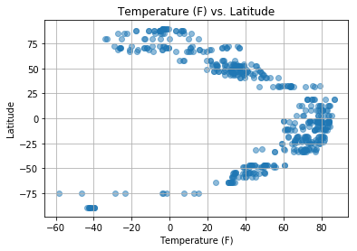
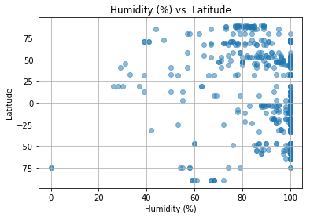
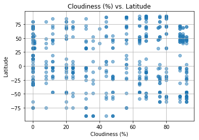
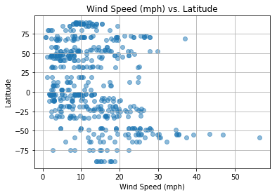

```python
import pandas as pd
import csv
import openweathermapy
#!pip install citipy
#The purpose of citipy is to look for nearest city with geo coordinates
from citipy import citipy 
from config import api_key
import requests

#For scatterplots
import numpy as np
import matplotlib.pyplot as plt
```


```python
#our objective is to build a series of scatter plots to showcase the following relationships:

#Temperature (F) vs. Latitude
#Humidity (%) vs. Latitude
#Cloudiness (%) vs. Latitude
#Wind Speed (mph) vs. Latitude


#&units={units}
#url = "http://api.openweathermap.org/data/2.5/weather?"
#api.openweathermap.org/data/2.5/weather?q={city name}

url = "http://api.openweathermap.org/data/2.5/weather?"

#For temperature in Fahrenheit use units=imperial
units = "imperial"


#query_url = f"{url}appid={api_key}&units={units}&q="

#cityname = "london"

####query_url = f"{url}q={cityname}&appid={api_key}&units={units}"

#query_url = f"{url}lat={long_coord}&lon={long_coord}&appid={api_key}&units={units}"
#http://samples.openweathermap.org/data/2.5/weather?lat=35&lon=139&appid=b6907d289e10d714a6e88b30761fae22&units=metric

#units={units}&
#?lat={lat}&lon={lon}

#r?lat=35&lon=139&appid=


#print(query_url)
```


```python
#Random long and Lat => Lat 0-90, Long 0-180
lat_coord = np.random.uniform(-90,91,50)
long_coord = np.random.uniform(-180,181,10)

#lat_coord
#long_coord
```


```python
#cities = ["Paris", "London", "Oslo", "Beijing"]


# set up lists to hold reponse info
lat = []
temp = []
humid = []
cloud = []
windsp = []


# Loop through the list of cities and perform a request for data on each
#for lati in lat_coord:

#for index, row in popular_tweeters.iterrows()
for lati in lat_coord:
    for longi in long_coord:
        query_url = f"{url}lat={lati}&lon={longi}&appid={api_key}&units=imperial"
    
    
        name_city = citipy.nearest_city(lati, longi).city_name
        print(f"{len(lat)+1}: Here is link for {name_city}:")
    
    
   # query_url = f"{url}q={name_city}&appid={api_key}&units={units}"
    
   
        print(query_url)   
    
        response = requests.get(query_url).json()
    
        temp.append(response['main']['temp'])
        lat.append(response['coord']['lat'])
        humid.append(response['main']['humidity'])
        cloud.append(response['clouds']['all'])
        windsp.append(response['wind']['speed'])

#print(f"The latitude information received is: {lat}")
#print(f"The temperature information received is: {temp}")
#print(f"The humid information received is: {humid}")
#print(f"The cloud information received is: {cloud}")
#print(f"The windspeed information received is: {windsp}")
```

    1: Here is link for kaitangata:
    http://api.openweathermap.org/data/2.5/weather?lat=-75.06934593944308&lon=175.68845545778925&appid=491e8debadb6f90f65269657341dc64e&units=imperial
    2: Here is link for punta arenas:
    http://api.openweathermap.org/data/2.5/weather?lat=-75.06934593944308&lon=-92.7346420370229&appid=491e8debadb6f90f65269657341dc64e&units=imperial
    3: Here is link for ushuaia:
    http://api.openweathermap.org/data/2.5/weather?lat=-75.06934593944308&lon=-71.81217301674963&appid=491e8debadb6f90f65269657341dc64e&units=imperial
    4: Here is link for bredasdorp:
    http://api.openweathermap.org/data/2.5/weather?lat=-75.06934593944308&lon=15.465528940286788&appid=491e8debadb6f90f65269657341dc64e&units=imperial
    5: Here is link for bredasdorp:
    http://api.openweathermap.org/data/2.5/weather?lat=-75.06934593944308&lon=25.87238048082824&appid=491e8debadb6f90f65269657341dc64e&units=imperial
    6: Here is link for mataura:
    http://api.openweathermap.org/data/2.5/weather?lat=-75.06934593944308&lon=-163.47481106791616&appid=491e8debadb6f90f65269657341dc64e&units=imperial
    7: Here is link for port elizabeth:
    http://api.openweathermap.org/data/2.5/weather?lat=-75.06934593944308&lon=31.080884043831247&appid=491e8debadb6f90f65269657341dc64e&units=imperial
    8: Here is link for rikitea:
    http://api.openweathermap.org/data/2.5/weather?lat=-75.06934593944308&lon=-129.77453681042348&appid=491e8debadb6f90f65269657341dc64e&units=imperial
    9: Here is link for punta arenas:
    http://api.openweathermap.org/data/2.5/weather?lat=-75.06934593944308&lon=-101.37656286327504&appid=491e8debadb6f90f65269657341dc64e&units=imperial
    10: Here is link for taolanaro:
    http://api.openweathermap.org/data/2.5/weather?lat=-75.06934593944308&lon=71.63325364786044&appid=491e8debadb6f90f65269657341dc64e&units=imperial
    11: Here is link for leningradskiy:
    http://api.openweathermap.org/data/2.5/weather?lat=68.80822441375713&lon=175.68845545778925&appid=491e8debadb6f90f65269657341dc64e&units=imperial
    12: Here is link for thompson:
    http://api.openweathermap.org/data/2.5/weather?lat=68.80822441375713&lon=-92.7346420370229&appid=491e8debadb6f90f65269657341dc64e&units=imperial
    13: Here is link for clyde river:
    http://api.openweathermap.org/data/2.5/weather?lat=68.80822441375713&lon=-71.81217301674963&appid=491e8debadb6f90f65269657341dc64e&units=imperial
    14: Here is link for strand:
    http://api.openweathermap.org/data/2.5/weather?lat=68.80822441375713&lon=15.465528940286788&appid=491e8debadb6f90f65269657341dc64e&units=imperial
    15: Here is link for karasjok:
    http://api.openweathermap.org/data/2.5/weather?lat=68.80822441375713&lon=25.87238048082824&appid=491e8debadb6f90f65269657341dc64e&units=imperial
    16: Here is link for nome:
    http://api.openweathermap.org/data/2.5/weather?lat=68.80822441375713&lon=-163.47481106791616&appid=491e8debadb6f90f65269657341dc64e&units=imperial
    17: Here is link for zapolyarnyy:
    http://api.openweathermap.org/data/2.5/weather?lat=68.80822441375713&lon=31.080884043831247&appid=491e8debadb6f90f65269657341dc64e&units=imperial
    18: Here is link for tuktoyaktuk:
    http://api.openweathermap.org/data/2.5/weather?lat=68.80822441375713&lon=-129.77453681042348&appid=491e8debadb6f90f65269657341dc64e&units=imperial
    19: Here is link for thompson:
    http://api.openweathermap.org/data/2.5/weather?lat=68.80822441375713&lon=-101.37656286327504&appid=491e8debadb6f90f65269657341dc64e&units=imperial
    20: Here is link for yar-sale:
    http://api.openweathermap.org/data/2.5/weather?lat=68.80822441375713&lon=71.63325364786044&appid=491e8debadb6f90f65269657341dc64e&units=imperial
    21: Here is link for leningradskiy:
    http://api.openweathermap.org/data/2.5/weather?lat=70.85779156584653&lon=175.68845545778925&appid=491e8debadb6f90f65269657341dc64e&units=imperial
    22: Here is link for thompson:
    http://api.openweathermap.org/data/2.5/weather?lat=70.85779156584653&lon=-92.7346420370229&appid=491e8debadb6f90f65269657341dc64e&units=imperial
    23: Here is link for clyde river:
    http://api.openweathermap.org/data/2.5/weather?lat=70.85779156584653&lon=-71.81217301674963&appid=491e8debadb6f90f65269657341dc64e&units=imperial
    24: Here is link for andenes:
    http://api.openweathermap.org/data/2.5/weather?lat=70.85779156584653&lon=15.465528940286788&appid=491e8debadb6f90f65269657341dc64e&units=imperial
    25: Here is link for honningsvag:
    http://api.openweathermap.org/data/2.5/weather?lat=70.85779156584653&lon=25.87238048082824&appid=491e8debadb6f90f65269657341dc64e&units=imperial
    26: Here is link for nome:
    http://api.openweathermap.org/data/2.5/weather?lat=70.85779156584653&lon=-163.47481106791616&appid=491e8debadb6f90f65269657341dc64e&units=imperial
    27: Here is link for vardo:
    http://api.openweathermap.org/data/2.5/weather?lat=70.85779156584653&lon=31.080884043831247&appid=491e8debadb6f90f65269657341dc64e&units=imperial
    28: Here is link for tuktoyaktuk:
    http://api.openweathermap.org/data/2.5/weather?lat=70.85779156584653&lon=-129.77453681042348&appid=491e8debadb6f90f65269657341dc64e&units=imperial
    29: Here is link for yellowknife:
    http://api.openweathermap.org/data/2.5/weather?lat=70.85779156584653&lon=-101.37656286327504&appid=491e8debadb6f90f65269657341dc64e&units=imperial
    30: Here is link for yar-sale:
    http://api.openweathermap.org/data/2.5/weather?lat=70.85779156584653&lon=71.63325364786044&appid=491e8debadb6f90f65269657341dc64e&units=imperial
    31: Here is link for isangel:
    http://api.openweathermap.org/data/2.5/weather?lat=-18.468601316198118&lon=175.68845545778925&appid=491e8debadb6f90f65269657341dc64e&units=imperial
    32: Here is link for hualmay:
    http://api.openweathermap.org/data/2.5/weather?lat=-18.468601316198118&lon=-92.7346420370229&appid=491e8debadb6f90f65269657341dc64e&units=imperial
    33: Here is link for ilo:
    http://api.openweathermap.org/data/2.5/weather?lat=-18.468601316198118&lon=-71.81217301674963&appid=491e8debadb6f90f65269657341dc64e&units=imperial
    34: Here is link for ongandjera:
    http://api.openweathermap.org/data/2.5/weather?lat=-18.468601316198118&lon=15.465528940286788&appid=491e8debadb6f90f65269657341dc64e&units=imperial
    35: Here is link for pandamatenga:
    http://api.openweathermap.org/data/2.5/weather?lat=-18.468601316198118&lon=25.87238048082824&appid=491e8debadb6f90f65269657341dc64e&units=imperial
    36: Here is link for avarua:
    http://api.openweathermap.org/data/2.5/weather?lat=-18.468601316198118&lon=-163.47481106791616&appid=491e8debadb6f90f65269657341dc64e&units=imperial
    37: Here is link for chitungwiza:
    http://api.openweathermap.org/data/2.5/weather?lat=-18.468601316198118&lon=31.080884043831247&appid=491e8debadb6f90f65269657341dc64e&units=imperial
    38: Here is link for rikitea:
    http://api.openweathermap.org/data/2.5/weather?lat=-18.468601316198118&lon=-129.77453681042348&appid=491e8debadb6f90f65269657341dc64e&units=imperial
    39: Here is link for puerto ayora:
    http://api.openweathermap.org/data/2.5/weather?lat=-18.468601316198118&lon=-101.37656286327504&appid=491e8debadb6f90f65269657341dc64e&units=imperial
    40: Here is link for grand river south east:
    http://api.openweathermap.org/data/2.5/weather?lat=-18.468601316198118&lon=71.63325364786044&appid=491e8debadb6f90f65269657341dc64e&units=imperial
    41: Here is link for nikolskoye:
    http://api.openweathermap.org/data/2.5/weather?lat=41.02903970895366&lon=175.68845545778925&appid=491e8debadb6f90f65269657341dc64e&units=imperial
    42: Here is link for oskaloosa:
    http://api.openweathermap.org/data/2.5/weather?lat=41.02903970895366&lon=-92.7346420370229&appid=491e8debadb6f90f65269657341dc64e&units=imperial
    43: Here is link for westerly:
    http://api.openweathermap.org/data/2.5/weather?lat=41.02903970895366&lon=-71.81217301674963&appid=491e8debadb6f90f65269657341dc64e&units=imperial
    44: Here is link for melfi:
    http://api.openweathermap.org/data/2.5/weather?lat=41.02903970895366&lon=15.465528940286788&appid=491e8debadb6f90f65269657341dc64e&units=imperial
    45: Here is link for sapai:
    http://api.openweathermap.org/data/2.5/weather?lat=41.02903970895366&lon=25.87238048082824&appid=491e8debadb6f90f65269657341dc64e&units=imperial
    46: Here is link for kapaa:
    http://api.openweathermap.org/data/2.5/weather?lat=41.02903970895366&lon=-163.47481106791616&appid=491e8debadb6f90f65269657341dc64e&units=imperial
    47: Here is link for akcakoca:
    http://api.openweathermap.org/data/2.5/weather?lat=41.02903970895366&lon=31.080884043831247&appid=491e8debadb6f90f65269657341dc64e&units=imperial
    48: Here is link for eureka:
    http://api.openweathermap.org/data/2.5/weather?lat=41.02903970895366&lon=-129.77453681042348&appid=491e8debadb6f90f65269657341dc64e&units=imperial
    49: Here is link for north platte:
    http://api.openweathermap.org/data/2.5/weather?lat=41.02903970895366&lon=-101.37656286327504&appid=491e8debadb6f90f65269657341dc64e&units=imperial
    50: Here is link for namangan:
    http://api.openweathermap.org/data/2.5/weather?lat=41.02903970895366&lon=71.63325364786044&appid=491e8debadb6f90f65269657341dc64e&units=imperial
    51: Here is link for asau:
    http://api.openweathermap.org/data/2.5/weather?lat=-11.90706626050887&lon=175.68845545778925&appid=491e8debadb6f90f65269657341dc64e&units=imperial
    52: Here is link for puerto ayora:
    http://api.openweathermap.org/data/2.5/weather?lat=-11.90706626050887&lon=-92.7346420370229&appid=491e8debadb6f90f65269657341dc64e&units=imperial
    53: Here is link for pangoa:
    http://api.openweathermap.org/data/2.5/weather?lat=-11.90706626050887&lon=-71.81217301674963&appid=491e8debadb6f90f65269657341dc64e&units=imperial
    54: Here is link for huambo:
    http://api.openweathermap.org/data/2.5/weather?lat=-11.90706626050887&lon=15.465528940286788&appid=491e8debadb6f90f65269657341dc64e&units=imperial
    55: Here is link for kansanshi:
    http://api.openweathermap.org/data/2.5/weather?lat=-11.90706626050887&lon=25.87238048082824&appid=491e8debadb6f90f65269657341dc64e&units=imperial
    56: Here is link for samusu:
    http://api.openweathermap.org/data/2.5/weather?lat=-11.90706626050887&lon=-163.47481106791616&appid=491e8debadb6f90f65269657341dc64e&units=imperial
    57: Here is link for mpika:
    http://api.openweathermap.org/data/2.5/weather?lat=-11.90706626050887&lon=31.080884043831247&appid=491e8debadb6f90f65269657341dc64e&units=imperial
    58: Here is link for atuona:
    http://api.openweathermap.org/data/2.5/weather?lat=-11.90706626050887&lon=-129.77453681042348&appid=491e8debadb6f90f65269657341dc64e&units=imperial
    59: Here is link for puerto ayora:
    http://api.openweathermap.org/data/2.5/weather?lat=-11.90706626050887&lon=-101.37656286327504&appid=491e8debadb6f90f65269657341dc64e&units=imperial
    60: Here is link for hithadhoo:
    http://api.openweathermap.org/data/2.5/weather?lat=-11.90706626050887&lon=71.63325364786044&appid=491e8debadb6f90f65269657341dc64e&units=imperial
    61: Here is link for isangel:
    http://api.openweathermap.org/data/2.5/weather?lat=-18.191755570482158&lon=175.68845545778925&appid=491e8debadb6f90f65269657341dc64e&units=imperial
    62: Here is link for huarmey:
    http://api.openweathermap.org/data/2.5/weather?lat=-18.191755570482158&lon=-92.7346420370229&appid=491e8debadb6f90f65269657341dc64e&units=imperial
    63: Here is link for ilo:
    http://api.openweathermap.org/data/2.5/weather?lat=-18.191755570482158&lon=-71.81217301674963&appid=491e8debadb6f90f65269657341dc64e&units=imperial
    64: Here is link for oshakati:
    http://api.openweathermap.org/data/2.5/weather?lat=-18.191755570482158&lon=15.465528940286788&appid=491e8debadb6f90f65269657341dc64e&units=imperial
    65: Here is link for pandamatenga:
    http://api.openweathermap.org/data/2.5/weather?lat=-18.191755570482158&lon=25.87238048082824&appid=491e8debadb6f90f65269657341dc64e&units=imperial
    66: Here is link for avarua:
    http://api.openweathermap.org/data/2.5/weather?lat=-18.191755570482158&lon=-163.47481106791616&appid=491e8debadb6f90f65269657341dc64e&units=imperial
    67: Here is link for chitungwiza:
    http://api.openweathermap.org/data/2.5/weather?lat=-18.191755570482158&lon=31.080884043831247&appid=491e8debadb6f90f65269657341dc64e&units=imperial
    68: Here is link for rikitea:
    http://api.openweathermap.org/data/2.5/weather?lat=-18.191755570482158&lon=-129.77453681042348&appid=491e8debadb6f90f65269657341dc64e&units=imperial
    69: Here is link for puerto ayora:
    http://api.openweathermap.org/data/2.5/weather?lat=-18.191755570482158&lon=-101.37656286327504&appid=491e8debadb6f90f65269657341dc64e&units=imperial
    70: Here is link for grand river south east:
    http://api.openweathermap.org/data/2.5/weather?lat=-18.191755570482158&lon=71.63325364786044&appid=491e8debadb6f90f65269657341dc64e&units=imperial
    71: Here is link for lolua:
    http://api.openweathermap.org/data/2.5/weather?lat=-8.198326403378928&lon=175.68845545778925&appid=491e8debadb6f90f65269657341dc64e&units=imperial
    72: Here is link for puerto ayora:
    http://api.openweathermap.org/data/2.5/weather?lat=-8.198326403378928&lon=-92.7346420370229&appid=491e8debadb6f90f65269657341dc64e&units=imperial
    73: Here is link for porto walter:
    http://api.openweathermap.org/data/2.5/weather?lat=-8.198326403378928&lon=-71.81217301674963&appid=491e8debadb6f90f65269657341dc64e&units=imperial
    74: Here is link for camabatela:
    http://api.openweathermap.org/data/2.5/weather?lat=-8.198326403378928&lon=15.465528940286788&appid=491e8debadb6f90f65269657341dc64e&units=imperial
    75: Here is link for bukama:
    http://api.openweathermap.org/data/2.5/weather?lat=-8.198326403378928&lon=25.87238048082824&appid=491e8debadb6f90f65269657341dc64e&units=imperial
    76: Here is link for samusu:
    http://api.openweathermap.org/data/2.5/weather?lat=-8.198326403378928&lon=-163.47481106791616&appid=491e8debadb6f90f65269657341dc64e&units=imperial
    77: Here is link for matai:
    http://api.openweathermap.org/data/2.5/weather?lat=-8.198326403378928&lon=31.080884043831247&appid=491e8debadb6f90f65269657341dc64e&units=imperial
    78: Here is link for atuona:
    http://api.openweathermap.org/data/2.5/weather?lat=-8.198326403378928&lon=-129.77453681042348&appid=491e8debadb6f90f65269657341dc64e&units=imperial
    79: Here is link for puerto ayora:
    http://api.openweathermap.org/data/2.5/weather?lat=-8.198326403378928&lon=-101.37656286327504&appid=491e8debadb6f90f65269657341dc64e&units=imperial
    80: Here is link for hithadhoo:
    http://api.openweathermap.org/data/2.5/weather?lat=-8.198326403378928&lon=71.63325364786044&appid=491e8debadb6f90f65269657341dc64e&units=imperial
    81: Here is link for dunedin:
    http://api.openweathermap.org/data/2.5/weather?lat=-54.11343248437635&lon=175.68845545778925&appid=491e8debadb6f90f65269657341dc64e&units=imperial
    82: Here is link for punta arenas:
    http://api.openweathermap.org/data/2.5/weather?lat=-54.11343248437635&lon=-92.7346420370229&appid=491e8debadb6f90f65269657341dc64e&units=imperial
    83: Here is link for punta arenas:
    http://api.openweathermap.org/data/2.5/weather?lat=-54.11343248437635&lon=-71.81217301674963&appid=491e8debadb6f90f65269657341dc64e&units=imperial
    84: Here is link for hermanus:
    http://api.openweathermap.org/data/2.5/weather?lat=-54.11343248437635&lon=15.465528940286788&appid=491e8debadb6f90f65269657341dc64e&units=imperial
    85: Here is link for kruisfontein:
    http://api.openweathermap.org/data/2.5/weather?lat=-54.11343248437635&lon=25.87238048082824&appid=491e8debadb6f90f65269657341dc64e&units=imperial
    86: Here is link for avarua:
    http://api.openweathermap.org/data/2.5/weather?lat=-54.11343248437635&lon=-163.47481106791616&appid=491e8debadb6f90f65269657341dc64e&units=imperial
    87: Here is link for port elizabeth:
    http://api.openweathermap.org/data/2.5/weather?lat=-54.11343248437635&lon=31.080884043831247&appid=491e8debadb6f90f65269657341dc64e&units=imperial
    88: Here is link for rikitea:
    http://api.openweathermap.org/data/2.5/weather?lat=-54.11343248437635&lon=-129.77453681042348&appid=491e8debadb6f90f65269657341dc64e&units=imperial
    89: Here is link for castro:
    http://api.openweathermap.org/data/2.5/weather?lat=-54.11343248437635&lon=-101.37656286327504&appid=491e8debadb6f90f65269657341dc64e&units=imperial
    90: Here is link for saint-philippe:
    http://api.openweathermap.org/data/2.5/weather?lat=-54.11343248437635&lon=71.63325364786044&appid=491e8debadb6f90f65269657341dc64e&units=imperial
    91: Here is link for butaritari:
    http://api.openweathermap.org/data/2.5/weather?lat=18.68272190316833&lon=175.68845545778925&appid=491e8debadb6f90f65269657341dc64e&units=imperial
    92: Here is link for frontera:
    http://api.openweathermap.org/data/2.5/weather?lat=18.68272190316833&lon=-92.7346420370229&appid=491e8debadb6f90f65269657341dc64e&units=imperial
    93: Here is link for lascahobas:
    http://api.openweathermap.org/data/2.5/weather?lat=18.68272190316833&lon=-71.81217301674963&appid=491e8debadb6f90f65269657341dc64e&units=imperial
    94: Here is link for bilma:
    http://api.openweathermap.org/data/2.5/weather?lat=18.68272190316833&lon=15.465528940286788&appid=491e8debadb6f90f65269657341dc64e&units=imperial
    95: Here is link for kutum:
    http://api.openweathermap.org/data/2.5/weather?lat=18.68272190316833&lon=25.87238048082824&appid=491e8debadb6f90f65269657341dc64e&units=imperial
    96: Here is link for kapaa:
    http://api.openweathermap.org/data/2.5/weather?lat=18.68272190316833&lon=-163.47481106791616&appid=491e8debadb6f90f65269657341dc64e&units=imperial
    97: Here is link for marawi:
    http://api.openweathermap.org/data/2.5/weather?lat=18.68272190316833&lon=31.080884043831247&appid=491e8debadb6f90f65269657341dc64e&units=imperial
    98: Here is link for san quintin:
    http://api.openweathermap.org/data/2.5/weather?lat=18.68272190316833&lon=-129.77453681042348&appid=491e8debadb6f90f65269657341dc64e&units=imperial
    99: Here is link for churumuco:
    http://api.openweathermap.org/data/2.5/weather?lat=18.68272190316833&lon=-101.37656286327504&appid=491e8debadb6f90f65269657341dc64e&units=imperial
    100: Here is link for bombay:
    http://api.openweathermap.org/data/2.5/weather?lat=18.68272190316833&lon=71.63325364786044&appid=491e8debadb6f90f65269657341dc64e&units=imperial
    101: Here is link for leningradskiy:
    http://api.openweathermap.org/data/2.5/weather?lat=72.20250765198764&lon=175.68845545778925&appid=491e8debadb6f90f65269657341dc64e&units=imperial
    102: Here is link for thompson:
    http://api.openweathermap.org/data/2.5/weather?lat=72.20250765198764&lon=-92.7346420370229&appid=491e8debadb6f90f65269657341dc64e&units=imperial
    103: Here is link for clyde river:
    http://api.openweathermap.org/data/2.5/weather?lat=72.20250765198764&lon=-71.81217301674963&appid=491e8debadb6f90f65269657341dc64e&units=imperial
    104: Here is link for andenes:
    http://api.openweathermap.org/data/2.5/weather?lat=72.20250765198764&lon=15.465528940286788&appid=491e8debadb6f90f65269657341dc64e&units=imperial
    105: Here is link for honningsvag:
    http://api.openweathermap.org/data/2.5/weather?lat=72.20250765198764&lon=25.87238048082824&appid=491e8debadb6f90f65269657341dc64e&units=imperial
    106: Here is link for barrow:
    http://api.openweathermap.org/data/2.5/weather?lat=72.20250765198764&lon=-163.47481106791616&appid=491e8debadb6f90f65269657341dc64e&units=imperial
    107: Here is link for vardo:
    http://api.openweathermap.org/data/2.5/weather?lat=72.20250765198764&lon=31.080884043831247&appid=491e8debadb6f90f65269657341dc64e&units=imperial
    108: Here is link for tuktoyaktuk:
    http://api.openweathermap.org/data/2.5/weather?lat=72.20250765198764&lon=-129.77453681042348&appid=491e8debadb6f90f65269657341dc64e&units=imperial
    109: Here is link for yellowknife:
    http://api.openweathermap.org/data/2.5/weather?lat=72.20250765198764&lon=-101.37656286327504&appid=491e8debadb6f90f65269657341dc64e&units=imperial
    110: Here is link for yar-sale:
    http://api.openweathermap.org/data/2.5/weather?lat=72.20250765198764&lon=71.63325364786044&appid=491e8debadb6f90f65269657341dc64e&units=imperial
    111: Here is link for leningradskiy:
    http://api.openweathermap.org/data/2.5/weather?lat=87.66561014367872&lon=175.68845545778925&appid=491e8debadb6f90f65269657341dc64e&units=imperial
    112: Here is link for qaanaaq:
    http://api.openweathermap.org/data/2.5/weather?lat=87.66561014367872&lon=-92.7346420370229&appid=491e8debadb6f90f65269657341dc64e&units=imperial
    113: Here is link for qaanaaq:
    http://api.openweathermap.org/data/2.5/weather?lat=87.66561014367872&lon=-71.81217301674963&appid=491e8debadb6f90f65269657341dc64e&units=imperial
    114: Here is link for longyearbyen:
    http://api.openweathermap.org/data/2.5/weather?lat=87.66561014367872&lon=15.465528940286788&appid=491e8debadb6f90f65269657341dc64e&units=imperial
    115: Here is link for longyearbyen:
    http://api.openweathermap.org/data/2.5/weather?lat=87.66561014367872&lon=25.87238048082824&appid=491e8debadb6f90f65269657341dc64e&units=imperial
    116: Here is link for barrow:
    http://api.openweathermap.org/data/2.5/weather?lat=87.66561014367872&lon=-163.47481106791616&appid=491e8debadb6f90f65269657341dc64e&units=imperial
    117: Here is link for berlevag:
    http://api.openweathermap.org/data/2.5/weather?lat=87.66561014367872&lon=31.080884043831247&appid=491e8debadb6f90f65269657341dc64e&units=imperial
    118: Here is link for tuktoyaktuk:
    http://api.openweathermap.org/data/2.5/weather?lat=87.66561014367872&lon=-129.77453681042348&appid=491e8debadb6f90f65269657341dc64e&units=imperial
    119: Here is link for yellowknife:
    http://api.openweathermap.org/data/2.5/weather?lat=87.66561014367872&lon=-101.37656286327504&appid=491e8debadb6f90f65269657341dc64e&units=imperial
    120: Here is link for dikson:
    http://api.openweathermap.org/data/2.5/weather?lat=87.66561014367872&lon=71.63325364786044&appid=491e8debadb6f90f65269657341dc64e&units=imperial
    121: Here is link for leningradskiy:
    http://api.openweathermap.org/data/2.5/weather?lat=79.36013983235873&lon=175.68845545778925&appid=491e8debadb6f90f65269657341dc64e&units=imperial
    122: Here is link for qaanaaq:
    http://api.openweathermap.org/data/2.5/weather?lat=79.36013983235873&lon=-92.7346420370229&appid=491e8debadb6f90f65269657341dc64e&units=imperial
    123: Here is link for qaanaaq:
    http://api.openweathermap.org/data/2.5/weather?lat=79.36013983235873&lon=-71.81217301674963&appid=491e8debadb6f90f65269657341dc64e&units=imperial
    124: Here is link for longyearbyen:
    http://api.openweathermap.org/data/2.5/weather?lat=79.36013983235873&lon=15.465528940286788&appid=491e8debadb6f90f65269657341dc64e&units=imperial
    125: Here is link for honningsvag:
    http://api.openweathermap.org/data/2.5/weather?lat=79.36013983235873&lon=25.87238048082824&appid=491e8debadb6f90f65269657341dc64e&units=imperial
    126: Here is link for barrow:
    http://api.openweathermap.org/data/2.5/weather?lat=79.36013983235873&lon=-163.47481106791616&appid=491e8debadb6f90f65269657341dc64e&units=imperial
    127: Here is link for berlevag:
    http://api.openweathermap.org/data/2.5/weather?lat=79.36013983235873&lon=31.080884043831247&appid=491e8debadb6f90f65269657341dc64e&units=imperial
    128: Here is link for tuktoyaktuk:
    http://api.openweathermap.org/data/2.5/weather?lat=79.36013983235873&lon=-129.77453681042348&appid=491e8debadb6f90f65269657341dc64e&units=imperial
    129: Here is link for yellowknife:
    http://api.openweathermap.org/data/2.5/weather?lat=79.36013983235873&lon=-101.37656286327504&appid=491e8debadb6f90f65269657341dc64e&units=imperial
    130: Here is link for dikson:
    http://api.openweathermap.org/data/2.5/weather?lat=79.36013983235873&lon=71.63325364786044&appid=491e8debadb6f90f65269657341dc64e&units=imperial
    131: Here is link for beringovskiy:
    http://api.openweathermap.org/data/2.5/weather?lat=54.399824999197165&lon=175.68845545778925&appid=491e8debadb6f90f65269657341dc64e&units=imperial
    132: Here is link for sioux lookout:
    http://api.openweathermap.org/data/2.5/weather?lat=54.399824999197165&lon=-92.7346420370229&appid=491e8debadb6f90f65269657341dc64e&units=imperial
    133: Here is link for chapais:
    http://api.openweathermap.org/data/2.5/weather?lat=54.399824999197165&lon=-71.81217301674963&appid=491e8debadb6f90f65269657341dc64e&units=imperial
    134: Here is link for kolobrzeg:
    http://api.openweathermap.org/data/2.5/weather?lat=54.399824999197165&lon=15.465528940286788&appid=491e8debadb6f90f65269657341dc64e&units=imperial
    135: Here is link for salcininkai:
    http://api.openweathermap.org/data/2.5/weather?lat=54.399824999197165&lon=25.87238048082824&appid=491e8debadb6f90f65269657341dc64e&units=imperial
    136: Here is link for bethel:
    http://api.openweathermap.org/data/2.5/weather?lat=54.399824999197165&lon=-163.47481106791616&appid=491e8debadb6f90f65269657341dc64e&units=imperial
    137: Here is link for horki:
    http://api.openweathermap.org/data/2.5/weather?lat=54.399824999197165&lon=31.080884043831247&appid=491e8debadb6f90f65269657341dc64e&units=imperial
    138: Here is link for prince rupert:
    http://api.openweathermap.org/data/2.5/weather?lat=54.399824999197165&lon=-129.77453681042348&appid=491e8debadb6f90f65269657341dc64e&units=imperial
    139: Here is link for the pas:
    http://api.openweathermap.org/data/2.5/weather?lat=54.399824999197165&lon=-101.37656286327504&appid=491e8debadb6f90f65269657341dc64e&units=imperial
    140: Here is link for poltavka:
    http://api.openweathermap.org/data/2.5/weather?lat=54.399824999197165&lon=71.63325364786044&appid=491e8debadb6f90f65269657341dc64e&units=imperial
    141: Here is link for kaitangata:
    http://api.openweathermap.org/data/2.5/weather?lat=-58.66301141040426&lon=175.68845545778925&appid=491e8debadb6f90f65269657341dc64e&units=imperial
    142: Here is link for punta arenas:
    http://api.openweathermap.org/data/2.5/weather?lat=-58.66301141040426&lon=-92.7346420370229&appid=491e8debadb6f90f65269657341dc64e&units=imperial
    143: Here is link for ushuaia:
    http://api.openweathermap.org/data/2.5/weather?lat=-58.66301141040426&lon=-71.81217301674963&appid=491e8debadb6f90f65269657341dc64e&units=imperial
    144: Here is link for hermanus:
    http://api.openweathermap.org/data/2.5/weather?lat=-58.66301141040426&lon=15.465528940286788&appid=491e8debadb6f90f65269657341dc64e&units=imperial
    145: Here is link for kruisfontein:
    http://api.openweathermap.org/data/2.5/weather?lat=-58.66301141040426&lon=25.87238048082824&appid=491e8debadb6f90f65269657341dc64e&units=imperial
    146: Here is link for avarua:
    http://api.openweathermap.org/data/2.5/weather?lat=-58.66301141040426&lon=-163.47481106791616&appid=491e8debadb6f90f65269657341dc64e&units=imperial
    147: Here is link for port elizabeth:
    http://api.openweathermap.org/data/2.5/weather?lat=-58.66301141040426&lon=31.080884043831247&appid=491e8debadb6f90f65269657341dc64e&units=imperial
    148: Here is link for rikitea:
    http://api.openweathermap.org/data/2.5/weather?lat=-58.66301141040426&lon=-129.77453681042348&appid=491e8debadb6f90f65269657341dc64e&units=imperial
    149: Here is link for punta arenas:
    http://api.openweathermap.org/data/2.5/weather?lat=-58.66301141040426&lon=-101.37656286327504&appid=491e8debadb6f90f65269657341dc64e&units=imperial
    150: Here is link for saint-philippe:
    http://api.openweathermap.org/data/2.5/weather?lat=-58.66301141040426&lon=71.63325364786044&appid=491e8debadb6f90f65269657341dc64e&units=imperial
    151: Here is link for nikolskoye:
    http://api.openweathermap.org/data/2.5/weather?lat=32.87982089502813&lon=175.68845545778925&appid=491e8debadb6f90f65269657341dc64e&units=imperial
    152: Here is link for el dorado:
    http://api.openweathermap.org/data/2.5/weather?lat=32.87982089502813&lon=-92.7346420370229&appid=491e8debadb6f90f65269657341dc64e&units=imperial
    153: Here is link for havelock:
    http://api.openweathermap.org/data/2.5/weather?lat=32.87982089502813&lon=-71.81217301674963&appid=491e8debadb6f90f65269657341dc64e&units=imperial
    154: Here is link for misratah:
    http://api.openweathermap.org/data/2.5/weather?lat=32.87982089502813&lon=15.465528940286788&appid=491e8debadb6f90f65269657341dc64e&units=imperial
    155: Here is link for bardiyah:
    http://api.openweathermap.org/data/2.5/weather?lat=32.87982089502813&lon=25.87238048082824&appid=491e8debadb6f90f65269657341dc64e&units=imperial
    156: Here is link for kapaa:
    http://api.openweathermap.org/data/2.5/weather?lat=32.87982089502813&lon=-163.47481106791616&appid=491e8debadb6f90f65269657341dc64e&units=imperial
    157: Here is link for rosetta:
    http://api.openweathermap.org/data/2.5/weather?lat=32.87982089502813&lon=31.080884043831247&appid=491e8debadb6f90f65269657341dc64e&units=imperial
    158: Here is link for half moon bay:
    http://api.openweathermap.org/data/2.5/weather?lat=32.87982089502813&lon=-129.77453681042348&appid=491e8debadb6f90f65269657341dc64e&units=imperial
    159: Here is link for snyder:
    http://api.openweathermap.org/data/2.5/weather?lat=32.87982089502813&lon=-101.37656286327504&appid=491e8debadb6f90f65269657341dc64e&units=imperial
    160: Here is link for daud khel:
    http://api.openweathermap.org/data/2.5/weather?lat=32.87982089502813&lon=71.63325364786044&appid=491e8debadb6f90f65269657341dc64e&units=imperial
    161: Here is link for lolua:
    http://api.openweathermap.org/data/2.5/weather?lat=-4.442757386965582&lon=175.68845545778925&appid=491e8debadb6f90f65269657341dc64e&units=imperial
    162: Here is link for puerto ayora:
    http://api.openweathermap.org/data/2.5/weather?lat=-4.442757386965582&lon=-92.7346420370229&appid=491e8debadb6f90f65269657341dc64e&units=imperial
    163: Here is link for puerto narino:
    http://api.openweathermap.org/data/2.5/weather?lat=-4.442757386965582&lon=-71.81217301674963&appid=491e8debadb6f90f65269657341dc64e&units=imperial
    164: Here is link for kinshasa:
    http://api.openweathermap.org/data/2.5/weather?lat=-4.442757386965582&lon=15.465528940286788&appid=491e8debadb6f90f65269657341dc64e&units=imperial
    165: Here is link for kasongo:
    http://api.openweathermap.org/data/2.5/weather?lat=-4.442757386965582&lon=25.87238048082824&appid=491e8debadb6f90f65269657341dc64e&units=imperial
    166: Here is link for samusu:
    http://api.openweathermap.org/data/2.5/weather?lat=-4.442757386965582&lon=-163.47481106791616&appid=491e8debadb6f90f65269657341dc64e&units=imperial
    167: Here is link for nguruka:
    http://api.openweathermap.org/data/2.5/weather?lat=-4.442757386965582&lon=31.080884043831247&appid=491e8debadb6f90f65269657341dc64e&units=imperial
    168: Here is link for atuona:
    http://api.openweathermap.org/data/2.5/weather?lat=-4.442757386965582&lon=-129.77453681042348&appid=491e8debadb6f90f65269657341dc64e&units=imperial
    169: Here is link for puerto ayora:
    http://api.openweathermap.org/data/2.5/weather?lat=-4.442757386965582&lon=-101.37656286327504&appid=491e8debadb6f90f65269657341dc64e&units=imperial
    170: Here is link for hithadhoo:
    http://api.openweathermap.org/data/2.5/weather?lat=-4.442757386965582&lon=71.63325364786044&appid=491e8debadb6f90f65269657341dc64e&units=imperial
    171: Here is link for leningradskiy:
    http://api.openweathermap.org/data/2.5/weather?lat=71.05286524364453&lon=175.68845545778925&appid=491e8debadb6f90f65269657341dc64e&units=imperial
    172: Here is link for thompson:
    http://api.openweathermap.org/data/2.5/weather?lat=71.05286524364453&lon=-92.7346420370229&appid=491e8debadb6f90f65269657341dc64e&units=imperial
    173: Here is link for clyde river:
    http://api.openweathermap.org/data/2.5/weather?lat=71.05286524364453&lon=-71.81217301674963&appid=491e8debadb6f90f65269657341dc64e&units=imperial
    174: Here is link for andenes:
    http://api.openweathermap.org/data/2.5/weather?lat=71.05286524364453&lon=15.465528940286788&appid=491e8debadb6f90f65269657341dc64e&units=imperial
    175: Here is link for honningsvag:
    http://api.openweathermap.org/data/2.5/weather?lat=71.05286524364453&lon=25.87238048082824&appid=491e8debadb6f90f65269657341dc64e&units=imperial
    176: Here is link for barrow:
    http://api.openweathermap.org/data/2.5/weather?lat=71.05286524364453&lon=-163.47481106791616&appid=491e8debadb6f90f65269657341dc64e&units=imperial
    177: Here is link for vardo:
    http://api.openweathermap.org/data/2.5/weather?lat=71.05286524364453&lon=31.080884043831247&appid=491e8debadb6f90f65269657341dc64e&units=imperial
    178: Here is link for tuktoyaktuk:
    http://api.openweathermap.org/data/2.5/weather?lat=71.05286524364453&lon=-129.77453681042348&appid=491e8debadb6f90f65269657341dc64e&units=imperial
    179: Here is link for yellowknife:
    http://api.openweathermap.org/data/2.5/weather?lat=71.05286524364453&lon=-101.37656286327504&appid=491e8debadb6f90f65269657341dc64e&units=imperial
    180: Here is link for yar-sale:
    http://api.openweathermap.org/data/2.5/weather?lat=71.05286524364453&lon=71.63325364786044&appid=491e8debadb6f90f65269657341dc64e&units=imperial
    181: Here is link for kaeo:
    http://api.openweathermap.org/data/2.5/weather?lat=-31.654370638275175&lon=175.68845545778925&appid=491e8debadb6f90f65269657341dc64e&units=imperial
    182: Here is link for lebu:
    http://api.openweathermap.org/data/2.5/weather?lat=-31.654370638275175&lon=-92.7346420370229&appid=491e8debadb6f90f65269657341dc64e&units=imperial
    183: Here is link for illapel:
    http://api.openweathermap.org/data/2.5/weather?lat=-31.654370638275175&lon=-71.81217301674963&appid=491e8debadb6f90f65269657341dc64e&units=imperial
    184: Here is link for saldanha:
    http://api.openweathermap.org/data/2.5/weather?lat=-31.654370638275175&lon=15.465528940286788&appid=491e8debadb6f90f65269657341dc64e&units=imperial
    185: Here is link for molteno:
    http://api.openweathermap.org/data/2.5/weather?lat=-31.654370638275175&lon=25.87238048082824&appid=491e8debadb6f90f65269657341dc64e&units=imperial
    186: Here is link for avarua:
    http://api.openweathermap.org/data/2.5/weather?lat=-31.654370638275175&lon=-163.47481106791616&appid=491e8debadb6f90f65269657341dc64e&units=imperial
    187: Here is link for margate:
    http://api.openweathermap.org/data/2.5/weather?lat=-31.654370638275175&lon=31.080884043831247&appid=491e8debadb6f90f65269657341dc64e&units=imperial
    188: Here is link for rikitea:
    http://api.openweathermap.org/data/2.5/weather?lat=-31.654370638275175&lon=-129.77453681042348&appid=491e8debadb6f90f65269657341dc64e&units=imperial
    189: Here is link for lebu:
    http://api.openweathermap.org/data/2.5/weather?lat=-31.654370638275175&lon=-101.37656286327504&appid=491e8debadb6f90f65269657341dc64e&units=imperial
    190: Here is link for bambous virieux:
    http://api.openweathermap.org/data/2.5/weather?lat=-31.654370638275175&lon=71.63325364786044&appid=491e8debadb6f90f65269657341dc64e&units=imperial
    191: Here is link for kaitangata:
    http://api.openweathermap.org/data/2.5/weather?lat=-64.00262990935917&lon=175.68845545778925&appid=491e8debadb6f90f65269657341dc64e&units=imperial
    192: Here is link for punta arenas:
    http://api.openweathermap.org/data/2.5/weather?lat=-64.00262990935917&lon=-92.7346420370229&appid=491e8debadb6f90f65269657341dc64e&units=imperial
    193: Here is link for ushuaia:
    http://api.openweathermap.org/data/2.5/weather?lat=-64.00262990935917&lon=-71.81217301674963&appid=491e8debadb6f90f65269657341dc64e&units=imperial
    194: Here is link for hermanus:
    http://api.openweathermap.org/data/2.5/weather?lat=-64.00262990935917&lon=15.465528940286788&appid=491e8debadb6f90f65269657341dc64e&units=imperial
    195: Here is link for kruisfontein:
    http://api.openweathermap.org/data/2.5/weather?lat=-64.00262990935917&lon=25.87238048082824&appid=491e8debadb6f90f65269657341dc64e&units=imperial
    196: Here is link for avarua:
    http://api.openweathermap.org/data/2.5/weather?lat=-64.00262990935917&lon=-163.47481106791616&appid=491e8debadb6f90f65269657341dc64e&units=imperial
    197: Here is link for port elizabeth:
    http://api.openweathermap.org/data/2.5/weather?lat=-64.00262990935917&lon=31.080884043831247&appid=491e8debadb6f90f65269657341dc64e&units=imperial
    198: Here is link for rikitea:
    http://api.openweathermap.org/data/2.5/weather?lat=-64.00262990935917&lon=-129.77453681042348&appid=491e8debadb6f90f65269657341dc64e&units=imperial
    199: Here is link for punta arenas:
    http://api.openweathermap.org/data/2.5/weather?lat=-64.00262990935917&lon=-101.37656286327504&appid=491e8debadb6f90f65269657341dc64e&units=imperial
    200: Here is link for saint-philippe:
    http://api.openweathermap.org/data/2.5/weather?lat=-64.00262990935917&lon=71.63325364786044&appid=491e8debadb6f90f65269657341dc64e&units=imperial
    201: Here is link for rawannawi:
    http://api.openweathermap.org/data/2.5/weather?lat=2.948189794136681&lon=175.68845545778925&appid=491e8debadb6f90f65269657341dc64e&units=imperial
    202: Here is link for puerto ayora:
    http://api.openweathermap.org/data/2.5/weather?lat=2.948189794136681&lon=-92.7346420370229&appid=491e8debadb6f90f65269657341dc64e&units=imperial
    203: Here is link for mapiripan:
    http://api.openweathermap.org/data/2.5/weather?lat=2.948189794136681&lon=-71.81217301674963&appid=491e8debadb6f90f65269657341dc64e&units=imperial
    204: Here is link for yokadouma:
    http://api.openweathermap.org/data/2.5/weather?lat=2.948189794136681&lon=15.465528940286788&appid=491e8debadb6f90f65269657341dc64e&units=imperial
    205: Here is link for buta:
    http://api.openweathermap.org/data/2.5/weather?lat=2.948189794136681&lon=25.87238048082824&appid=491e8debadb6f90f65269657341dc64e&units=imperial
    206: Here is link for samalaeulu:
    http://api.openweathermap.org/data/2.5/weather?lat=2.948189794136681&lon=-163.47481106791616&appid=491e8debadb6f90f65269657341dc64e&units=imperial
    207: Here is link for arua:
    http://api.openweathermap.org/data/2.5/weather?lat=2.948189794136681&lon=31.080884043831247&appid=491e8debadb6f90f65269657341dc64e&units=imperial
    208: Here is link for atuona:
    http://api.openweathermap.org/data/2.5/weather?lat=2.948189794136681&lon=-129.77453681042348&appid=491e8debadb6f90f65269657341dc64e&units=imperial
    209: Here is link for puerto ayora:
    http://api.openweathermap.org/data/2.5/weather?lat=2.948189794136681&lon=-101.37656286327504&appid=491e8debadb6f90f65269657341dc64e&units=imperial
    210: Here is link for kudahuvadhoo:
    http://api.openweathermap.org/data/2.5/weather?lat=2.948189794136681&lon=71.63325364786044&appid=491e8debadb6f90f65269657341dc64e&units=imperial
    211: Here is link for anadyr:
    http://api.openweathermap.org/data/2.5/weather?lat=66.76626256577867&lon=175.68845545778925&appid=491e8debadb6f90f65269657341dc64e&units=imperial
    212: Here is link for thompson:
    http://api.openweathermap.org/data/2.5/weather?lat=66.76626256577867&lon=-92.7346420370229&appid=491e8debadb6f90f65269657341dc64e&units=imperial
    213: Here is link for iqaluit:
    http://api.openweathermap.org/data/2.5/weather?lat=66.76626256577867&lon=-71.81217301674963&appid=491e8debadb6f90f65269657341dc64e&units=imperial
    214: Here is link for rognan:
    http://api.openweathermap.org/data/2.5/weather?lat=66.76626256577867&lon=15.465528940286788&appid=491e8debadb6f90f65269657341dc64e&units=imperial
    215: Here is link for rovaniemi:
    http://api.openweathermap.org/data/2.5/weather?lat=66.76626256577867&lon=25.87238048082824&appid=491e8debadb6f90f65269657341dc64e&units=imperial
    216: Here is link for nome:
    http://api.openweathermap.org/data/2.5/weather?lat=66.76626256577867&lon=-163.47481106791616&appid=491e8debadb6f90f65269657341dc64e&units=imperial
    217: Here is link for alakurtti:
    http://api.openweathermap.org/data/2.5/weather?lat=66.76626256577867&lon=31.080884043831247&appid=491e8debadb6f90f65269657341dc64e&units=imperial
    218: Here is link for norman wells:
    http://api.openweathermap.org/data/2.5/weather?lat=66.76626256577867&lon=-129.77453681042348&appid=491e8debadb6f90f65269657341dc64e&units=imperial
    219: Here is link for thompson:
    http://api.openweathermap.org/data/2.5/weather?lat=66.76626256577867&lon=-101.37656286327504&appid=491e8debadb6f90f65269657341dc64e&units=imperial
    220: Here is link for yar-sale:
    http://api.openweathermap.org/data/2.5/weather?lat=66.76626256577867&lon=71.63325364786044&appid=491e8debadb6f90f65269657341dc64e&units=imperial
    221: Here is link for nikolskoye:
    http://api.openweathermap.org/data/2.5/weather?lat=48.680139305736986&lon=175.68845545778925&appid=491e8debadb6f90f65269657341dc64e&units=imperial
    222: Here is link for fort frances:
    http://api.openweathermap.org/data/2.5/weather?lat=48.680139305736986&lon=-92.7346420370229&appid=491e8debadb6f90f65269657341dc64e&units=imperial
    223: Here is link for saint-gedeon:
    http://api.openweathermap.org/data/2.5/weather?lat=48.680139305736986&lon=-71.81217301674963&appid=491e8debadb6f90f65269657341dc64e&units=imperial
    224: Here is link for horn:
    http://api.openweathermap.org/data/2.5/weather?lat=48.680139305736986&lon=15.465528940286788&appid=491e8debadb6f90f65269657341dc64e&units=imperial
    225: Here is link for zalishchyky:
    http://api.openweathermap.org/data/2.5/weather?lat=48.680139305736986&lon=25.87238048082824&appid=491e8debadb6f90f65269657341dc64e&units=imperial
    226: Here is link for bethel:
    http://api.openweathermap.org/data/2.5/weather?lat=48.680139305736986&lon=-163.47481106791616&appid=491e8debadb6f90f65269657341dc64e&units=imperial
    227: Here is link for tyshkivka:
    http://api.openweathermap.org/data/2.5/weather?lat=48.680139305736986&lon=31.080884043831247&appid=491e8debadb6f90f65269657341dc64e&units=imperial
    228: Here is link for port hardy:
    http://api.openweathermap.org/data/2.5/weather?lat=48.680139305736986&lon=-129.77453681042348&appid=491e8debadb6f90f65269657341dc64e&units=imperial
    229: Here is link for minot:
    http://api.openweathermap.org/data/2.5/weather?lat=48.680139305736986&lon=-101.37656286327504&appid=491e8debadb6f90f65269657341dc64e&units=imperial
    230: Here is link for atasu:
    http://api.openweathermap.org/data/2.5/weather?lat=48.680139305736986&lon=71.63325364786044&appid=491e8debadb6f90f65269657341dc64e&units=imperial
    231: Here is link for nikolskoye:
    http://api.openweathermap.org/data/2.5/weather?lat=31.331909136768616&lon=175.68845545778925&appid=491e8debadb6f90f65269657341dc64e&units=imperial
    232: Here is link for alexandria:
    http://api.openweathermap.org/data/2.5/weather?lat=31.331909136768616&lon=-92.7346420370229&appid=491e8debadb6f90f65269657341dc64e&units=imperial
    233: Here is link for havelock:
    http://api.openweathermap.org/data/2.5/weather?lat=31.331909136768616&lon=-71.81217301674963&appid=491e8debadb6f90f65269657341dc64e&units=imperial
    234: Here is link for misratah:
    http://api.openweathermap.org/data/2.5/weather?lat=31.331909136768616&lon=15.465528940286788&appid=491e8debadb6f90f65269657341dc64e&units=imperial
    235: Here is link for bardiyah:
    http://api.openweathermap.org/data/2.5/weather?lat=31.331909136768616&lon=25.87238048082824&appid=491e8debadb6f90f65269657341dc64e&units=imperial
    236: Here is link for kapaa:
    http://api.openweathermap.org/data/2.5/weather?lat=31.331909136768616&lon=-163.47481106791616&appid=491e8debadb6f90f65269657341dc64e&units=imperial
    237: Here is link for el mahalla el kubra:
    http://api.openweathermap.org/data/2.5/weather?lat=31.331909136768616&lon=31.080884043831247&appid=491e8debadb6f90f65269657341dc64e&units=imperial
    238: Here is link for pacific grove:
    http://api.openweathermap.org/data/2.5/weather?lat=31.331909136768616&lon=-129.77453681042348&appid=491e8debadb6f90f65269657341dc64e&units=imperial
    239: Here is link for big spring:
    http://api.openweathermap.org/data/2.5/weather?lat=31.331909136768616&lon=-101.37656286327504&appid=491e8debadb6f90f65269657341dc64e&units=imperial
    240: Here is link for mankera:
    http://api.openweathermap.org/data/2.5/weather?lat=31.331909136768616&lon=71.63325364786044&appid=491e8debadb6f90f65269657341dc64e&units=imperial
    241: Here is link for leningradskiy:
    http://api.openweathermap.org/data/2.5/weather?lat=89.37481797372044&lon=175.68845545778925&appid=491e8debadb6f90f65269657341dc64e&units=imperial
    242: Here is link for qaanaaq:
    http://api.openweathermap.org/data/2.5/weather?lat=89.37481797372044&lon=-92.7346420370229&appid=491e8debadb6f90f65269657341dc64e&units=imperial
    243: Here is link for qaanaaq:
    http://api.openweathermap.org/data/2.5/weather?lat=89.37481797372044&lon=-71.81217301674963&appid=491e8debadb6f90f65269657341dc64e&units=imperial
    244: Here is link for longyearbyen:
    http://api.openweathermap.org/data/2.5/weather?lat=89.37481797372044&lon=15.465528940286788&appid=491e8debadb6f90f65269657341dc64e&units=imperial
    245: Here is link for longyearbyen:
    http://api.openweathermap.org/data/2.5/weather?lat=89.37481797372044&lon=25.87238048082824&appid=491e8debadb6f90f65269657341dc64e&units=imperial
    246: Here is link for barrow:
    http://api.openweathermap.org/data/2.5/weather?lat=89.37481797372044&lon=-163.47481106791616&appid=491e8debadb6f90f65269657341dc64e&units=imperial
    247: Here is link for mehamn:
    http://api.openweathermap.org/data/2.5/weather?lat=89.37481797372044&lon=31.080884043831247&appid=491e8debadb6f90f65269657341dc64e&units=imperial
    248: Here is link for tuktoyaktuk:
    http://api.openweathermap.org/data/2.5/weather?lat=89.37481797372044&lon=-129.77453681042348&appid=491e8debadb6f90f65269657341dc64e&units=imperial
    249: Here is link for yellowknife:
    http://api.openweathermap.org/data/2.5/weather?lat=89.37481797372044&lon=-101.37656286327504&appid=491e8debadb6f90f65269657341dc64e&units=imperial
    250: Here is link for dikson:
    http://api.openweathermap.org/data/2.5/weather?lat=89.37481797372044&lon=71.63325364786044&appid=491e8debadb6f90f65269657341dc64e&units=imperial
    251: Here is link for nikolskoye:
    http://api.openweathermap.org/data/2.5/weather?lat=43.78785296485029&lon=175.68845545778925&appid=491e8debadb6f90f65269657341dc64e&units=imperial
    252: Here is link for austin:
    http://api.openweathermap.org/data/2.5/weather?lat=43.78785296485029&lon=-92.7346420370229&appid=491e8debadb6f90f65269657341dc64e&units=imperial
    253: Here is link for plymouth:
    http://api.openweathermap.org/data/2.5/weather?lat=43.78785296485029&lon=-71.81217301674963&appid=491e8debadb6f90f65269657341dc64e&units=imperial
    254: Here is link for biograd na moru:
    http://api.openweathermap.org/data/2.5/weather?lat=43.78785296485029&lon=15.465528940286788&appid=491e8debadb6f90f65269657341dc64e&units=imperial
    255: Here is link for slobozia:
    http://api.openweathermap.org/data/2.5/weather?lat=43.78785296485029&lon=25.87238048082824&appid=491e8debadb6f90f65269657341dc64e&units=imperial
    256: Here is link for bethel:
    http://api.openweathermap.org/data/2.5/weather?lat=43.78785296485029&lon=-163.47481106791616&appid=491e8debadb6f90f65269657341dc64e&units=imperial
    257: Here is link for sfantu gheorghe:
    http://api.openweathermap.org/data/2.5/weather?lat=43.78785296485029&lon=31.080884043831247&appid=491e8debadb6f90f65269657341dc64e&units=imperial
    258: Here is link for north bend:
    http://api.openweathermap.org/data/2.5/weather?lat=43.78785296485029&lon=-129.77453681042348&appid=491e8debadb6f90f65269657341dc64e&units=imperial
    259: Here is link for pierre:
    http://api.openweathermap.org/data/2.5/weather?lat=43.78785296485029&lon=-101.37656286327504&appid=491e8debadb6f90f65269657341dc64e&units=imperial
    260: Here is link for mikhaylovka:
    http://api.openweathermap.org/data/2.5/weather?lat=43.78785296485029&lon=71.63325364786044&appid=491e8debadb6f90f65269657341dc64e&units=imperial
    261: Here is link for nikolskoye:
    http://api.openweathermap.org/data/2.5/weather?lat=47.53425841644352&lon=175.68845545778925&appid=491e8debadb6f90f65269657341dc64e&units=imperial
    262: Here is link for hibbing:
    http://api.openweathermap.org/data/2.5/weather?lat=47.53425841644352&lon=-92.7346420370229&appid=491e8debadb6f90f65269657341dc64e&units=imperial
    263: Here is link for saint-raymond:
    http://api.openweathermap.org/data/2.5/weather?lat=47.53425841644352&lon=-71.81217301674963&appid=491e8debadb6f90f65269657341dc64e&units=imperial
    264: Here is link for kindberg:
    http://api.openweathermap.org/data/2.5/weather?lat=47.53425841644352&lon=15.465528940286788&appid=491e8debadb6f90f65269657341dc64e&units=imperial
    265: Here is link for gura humorului:
    http://api.openweathermap.org/data/2.5/weather?lat=47.53425841644352&lon=25.87238048082824&appid=491e8debadb6f90f65269657341dc64e&units=imperial
    266: Here is link for bethel:
    http://api.openweathermap.org/data/2.5/weather?lat=47.53425841644352&lon=-163.47481106791616&appid=491e8debadb6f90f65269657341dc64e&units=imperial
    267: Here is link for domanivka:
    http://api.openweathermap.org/data/2.5/weather?lat=47.53425841644352&lon=31.080884043831247&appid=491e8debadb6f90f65269657341dc64e&units=imperial
    268: Here is link for port hardy:
    http://api.openweathermap.org/data/2.5/weather?lat=47.53425841644352&lon=-129.77453681042348&appid=491e8debadb6f90f65269657341dc64e&units=imperial
    269: Here is link for minot:
    http://api.openweathermap.org/data/2.5/weather?lat=47.53425841644352&lon=-101.37656286327504&appid=491e8debadb6f90f65269657341dc64e&units=imperial
    270: Here is link for atasu:
    http://api.openweathermap.org/data/2.5/weather?lat=47.53425841644352&lon=71.63325364786044&appid=491e8debadb6f90f65269657341dc64e&units=imperial
    271: Here is link for leningradskiy:
    http://api.openweathermap.org/data/2.5/weather?lat=85.34442969053359&lon=175.68845545778925&appid=491e8debadb6f90f65269657341dc64e&units=imperial
    272: Here is link for qaanaaq:
    http://api.openweathermap.org/data/2.5/weather?lat=85.34442969053359&lon=-92.7346420370229&appid=491e8debadb6f90f65269657341dc64e&units=imperial
    273: Here is link for qaanaaq:
    http://api.openweathermap.org/data/2.5/weather?lat=85.34442969053359&lon=-71.81217301674963&appid=491e8debadb6f90f65269657341dc64e&units=imperial
    274: Here is link for longyearbyen:
    http://api.openweathermap.org/data/2.5/weather?lat=85.34442969053359&lon=15.465528940286788&appid=491e8debadb6f90f65269657341dc64e&units=imperial
    275: Here is link for longyearbyen:
    http://api.openweathermap.org/data/2.5/weather?lat=85.34442969053359&lon=25.87238048082824&appid=491e8debadb6f90f65269657341dc64e&units=imperial
    276: Here is link for barrow:
    http://api.openweathermap.org/data/2.5/weather?lat=85.34442969053359&lon=-163.47481106791616&appid=491e8debadb6f90f65269657341dc64e&units=imperial
    277: Here is link for berlevag:
    http://api.openweathermap.org/data/2.5/weather?lat=85.34442969053359&lon=31.080884043831247&appid=491e8debadb6f90f65269657341dc64e&units=imperial
    278: Here is link for tuktoyaktuk:
    http://api.openweathermap.org/data/2.5/weather?lat=85.34442969053359&lon=-129.77453681042348&appid=491e8debadb6f90f65269657341dc64e&units=imperial
    279: Here is link for yellowknife:
    http://api.openweathermap.org/data/2.5/weather?lat=85.34442969053359&lon=-101.37656286327504&appid=491e8debadb6f90f65269657341dc64e&units=imperial
    280: Here is link for dikson:
    http://api.openweathermap.org/data/2.5/weather?lat=85.34442969053359&lon=71.63325364786044&appid=491e8debadb6f90f65269657341dc64e&units=imperial
    281: Here is link for christchurch:
    http://api.openweathermap.org/data/2.5/weather?lat=-46.497609450794386&lon=175.68845545778925&appid=491e8debadb6f90f65269657341dc64e&units=imperial
    282: Here is link for castro:
    http://api.openweathermap.org/data/2.5/weather?lat=-46.497609450794386&lon=-92.7346420370229&appid=491e8debadb6f90f65269657341dc64e&units=imperial
    283: Here is link for coihaique:
    http://api.openweathermap.org/data/2.5/weather?lat=-46.497609450794386&lon=-71.81217301674963&appid=491e8debadb6f90f65269657341dc64e&units=imperial
    284: Here is link for hermanus:
    http://api.openweathermap.org/data/2.5/weather?lat=-46.497609450794386&lon=15.465528940286788&appid=491e8debadb6f90f65269657341dc64e&units=imperial
    285: Here is link for kruisfontein:
    http://api.openweathermap.org/data/2.5/weather?lat=-46.497609450794386&lon=25.87238048082824&appid=491e8debadb6f90f65269657341dc64e&units=imperial
    286: Here is link for avarua:
    http://api.openweathermap.org/data/2.5/weather?lat=-46.497609450794386&lon=-163.47481106791616&appid=491e8debadb6f90f65269657341dc64e&units=imperial
    287: Here is link for port alfred:
    http://api.openweathermap.org/data/2.5/weather?lat=-46.497609450794386&lon=31.080884043831247&appid=491e8debadb6f90f65269657341dc64e&units=imperial
    288: Here is link for rikitea:
    http://api.openweathermap.org/data/2.5/weather?lat=-46.497609450794386&lon=-129.77453681042348&appid=491e8debadb6f90f65269657341dc64e&units=imperial
    289: Here is link for castro:
    http://api.openweathermap.org/data/2.5/weather?lat=-46.497609450794386&lon=-101.37656286327504&appid=491e8debadb6f90f65269657341dc64e&units=imperial
    290: Here is link for souillac:
    http://api.openweathermap.org/data/2.5/weather?lat=-46.497609450794386&lon=71.63325364786044&appid=491e8debadb6f90f65269657341dc64e&units=imperial
    291: Here is link for kaeo:
    http://api.openweathermap.org/data/2.5/weather?lat=-30.628501353168424&lon=175.68845545778925&appid=491e8debadb6f90f65269657341dc64e&units=imperial
    292: Here is link for lebu:
    http://api.openweathermap.org/data/2.5/weather?lat=-30.628501353168424&lon=-92.7346420370229&appid=491e8debadb6f90f65269657341dc64e&units=imperial
    293: Here is link for ovalle:
    http://api.openweathermap.org/data/2.5/weather?lat=-30.628501353168424&lon=-71.81217301674963&appid=491e8debadb6f90f65269657341dc64e&units=imperial
    294: Here is link for oranjemund:
    http://api.openweathermap.org/data/2.5/weather?lat=-30.628501353168424&lon=15.465528940286788&appid=491e8debadb6f90f65269657341dc64e&units=imperial
    295: Here is link for burgersdorp:
    http://api.openweathermap.org/data/2.5/weather?lat=-30.628501353168424&lon=25.87238048082824&appid=491e8debadb6f90f65269657341dc64e&units=imperial
    296: Here is link for avarua:
    http://api.openweathermap.org/data/2.5/weather?lat=-30.628501353168424&lon=-163.47481106791616&appid=491e8debadb6f90f65269657341dc64e&units=imperial
    297: Here is link for scottsburgh:
    http://api.openweathermap.org/data/2.5/weather?lat=-30.628501353168424&lon=31.080884043831247&appid=491e8debadb6f90f65269657341dc64e&units=imperial
    298: Here is link for rikitea:
    http://api.openweathermap.org/data/2.5/weather?lat=-30.628501353168424&lon=-129.77453681042348&appid=491e8debadb6f90f65269657341dc64e&units=imperial
    299: Here is link for lebu:
    http://api.openweathermap.org/data/2.5/weather?lat=-30.628501353168424&lon=-101.37656286327504&appid=491e8debadb6f90f65269657341dc64e&units=imperial
    300: Here is link for bambous virieux:
    http://api.openweathermap.org/data/2.5/weather?lat=-30.628501353168424&lon=71.63325364786044&appid=491e8debadb6f90f65269657341dc64e&units=imperial
    301: Here is link for ijaki:
    http://api.openweathermap.org/data/2.5/weather?lat=-2.563237642604932&lon=175.68845545778925&appid=491e8debadb6f90f65269657341dc64e&units=imperial
    302: Here is link for puerto ayora:
    http://api.openweathermap.org/data/2.5/weather?lat=-2.563237642604932&lon=-92.7346420370229&appid=491e8debadb6f90f65269657341dc64e&units=imperial
    303: Here is link for iquitos:
    http://api.openweathermap.org/data/2.5/weather?lat=-2.563237642604932&lon=-71.81217301674963&appid=491e8debadb6f90f65269657341dc64e&units=imperial
    304: Here is link for djambala:
    http://api.openweathermap.org/data/2.5/weather?lat=-2.563237642604932&lon=15.465528940286788&appid=491e8debadb6f90f65269657341dc64e&units=imperial
    305: Here is link for kindu:
    http://api.openweathermap.org/data/2.5/weather?lat=-2.563237642604932&lon=25.87238048082824&appid=491e8debadb6f90f65269657341dc64e&units=imperial
    306: Here is link for samusu:
    http://api.openweathermap.org/data/2.5/weather?lat=-2.563237642604932&lon=-163.47481106791616&appid=491e8debadb6f90f65269657341dc64e&units=imperial
    307: Here is link for biharamulo:
    http://api.openweathermap.org/data/2.5/weather?lat=-2.563237642604932&lon=31.080884043831247&appid=491e8debadb6f90f65269657341dc64e&units=imperial
    308: Here is link for atuona:
    http://api.openweathermap.org/data/2.5/weather?lat=-2.563237642604932&lon=-129.77453681042348&appid=491e8debadb6f90f65269657341dc64e&units=imperial
    309: Here is link for puerto ayora:
    http://api.openweathermap.org/data/2.5/weather?lat=-2.563237642604932&lon=-101.37656286327504&appid=491e8debadb6f90f65269657341dc64e&units=imperial
    310: Here is link for hithadhoo:
    http://api.openweathermap.org/data/2.5/weather?lat=-2.563237642604932&lon=71.63325364786044&appid=491e8debadb6f90f65269657341dc64e&units=imperial
    311: Here is link for leningradskiy:
    http://api.openweathermap.org/data/2.5/weather?lat=87.75745240659887&lon=175.68845545778925&appid=491e8debadb6f90f65269657341dc64e&units=imperial
    312: Here is link for qaanaaq:
    http://api.openweathermap.org/data/2.5/weather?lat=87.75745240659887&lon=-92.7346420370229&appid=491e8debadb6f90f65269657341dc64e&units=imperial
    313: Here is link for qaanaaq:
    http://api.openweathermap.org/data/2.5/weather?lat=87.75745240659887&lon=-71.81217301674963&appid=491e8debadb6f90f65269657341dc64e&units=imperial
    314: Here is link for longyearbyen:
    http://api.openweathermap.org/data/2.5/weather?lat=87.75745240659887&lon=15.465528940286788&appid=491e8debadb6f90f65269657341dc64e&units=imperial
    315: Here is link for longyearbyen:
    http://api.openweathermap.org/data/2.5/weather?lat=87.75745240659887&lon=25.87238048082824&appid=491e8debadb6f90f65269657341dc64e&units=imperial
    316: Here is link for barrow:
    http://api.openweathermap.org/data/2.5/weather?lat=87.75745240659887&lon=-163.47481106791616&appid=491e8debadb6f90f65269657341dc64e&units=imperial
    317: Here is link for berlevag:
    http://api.openweathermap.org/data/2.5/weather?lat=87.75745240659887&lon=31.080884043831247&appid=491e8debadb6f90f65269657341dc64e&units=imperial
    318: Here is link for tuktoyaktuk:
    http://api.openweathermap.org/data/2.5/weather?lat=87.75745240659887&lon=-129.77453681042348&appid=491e8debadb6f90f65269657341dc64e&units=imperial
    319: Here is link for yellowknife:
    http://api.openweathermap.org/data/2.5/weather?lat=87.75745240659887&lon=-101.37656286327504&appid=491e8debadb6f90f65269657341dc64e&units=imperial
    320: Here is link for dikson:
    http://api.openweathermap.org/data/2.5/weather?lat=87.75745240659887&lon=71.63325364786044&appid=491e8debadb6f90f65269657341dc64e&units=imperial
    321: Here is link for asau:
    http://api.openweathermap.org/data/2.5/weather?lat=-10.578342898593462&lon=175.68845545778925&appid=491e8debadb6f90f65269657341dc64e&units=imperial
    322: Here is link for puerto ayora:
    http://api.openweathermap.org/data/2.5/weather?lat=-10.578342898593462&lon=-92.7346420370229&appid=491e8debadb6f90f65269657341dc64e&units=imperial
    323: Here is link for pangoa:
    http://api.openweathermap.org/data/2.5/weather?lat=-10.578342898593462&lon=-71.81217301674963&appid=491e8debadb6f90f65269657341dc64e&units=imperial
    324: Here is link for kibala:
    http://api.openweathermap.org/data/2.5/weather?lat=-10.578342898593462&lon=15.465528940286788&appid=491e8debadb6f90f65269657341dc64e&units=imperial
    325: Here is link for kambove:
    http://api.openweathermap.org/data/2.5/weather?lat=-10.578342898593462&lon=25.87238048082824&appid=491e8debadb6f90f65269657341dc64e&units=imperial
    326: Here is link for samusu:
    http://api.openweathermap.org/data/2.5/weather?lat=-10.578342898593462&lon=-163.47481106791616&appid=491e8debadb6f90f65269657341dc64e&units=imperial
    327: Here is link for kasama:
    http://api.openweathermap.org/data/2.5/weather?lat=-10.578342898593462&lon=31.080884043831247&appid=491e8debadb6f90f65269657341dc64e&units=imperial
    328: Here is link for atuona:
    http://api.openweathermap.org/data/2.5/weather?lat=-10.578342898593462&lon=-129.77453681042348&appid=491e8debadb6f90f65269657341dc64e&units=imperial
    329: Here is link for puerto ayora:
    http://api.openweathermap.org/data/2.5/weather?lat=-10.578342898593462&lon=-101.37656286327504&appid=491e8debadb6f90f65269657341dc64e&units=imperial
    330: Here is link for hithadhoo:
    http://api.openweathermap.org/data/2.5/weather?lat=-10.578342898593462&lon=71.63325364786044&appid=491e8debadb6f90f65269657341dc64e&units=imperial
    331: Here is link for beringovskiy:
    http://api.openweathermap.org/data/2.5/weather?lat=58.06211300908146&lon=175.68845545778925&appid=491e8debadb6f90f65269657341dc64e&units=imperial
    332: Here is link for thompson:
    http://api.openweathermap.org/data/2.5/weather?lat=58.06211300908146&lon=-92.7346420370229&appid=491e8debadb6f90f65269657341dc64e&units=imperial
    333: Here is link for iqaluit:
    http://api.openweathermap.org/data/2.5/weather?lat=58.06211300908146&lon=-71.81217301674963&appid=491e8debadb6f90f65269657341dc64e&units=imperial
    334: Here is link for linkoping:
    http://api.openweathermap.org/data/2.5/weather?lat=58.06211300908146&lon=15.465528940286788&appid=491e8debadb6f90f65269657341dc64e&units=imperial
    335: Here is link for torva:
    http://api.openweathermap.org/data/2.5/weather?lat=58.06211300908146&lon=25.87238048082824&appid=491e8debadb6f90f65269657341dc64e&units=imperial
    336: Here is link for bethel:
    http://api.openweathermap.org/data/2.5/weather?lat=58.06211300908146&lon=-163.47481106791616&appid=491e8debadb6f90f65269657341dc64e&units=imperial
    337: Here is link for staraya russa:
    http://api.openweathermap.org/data/2.5/weather?lat=58.06211300908146&lon=31.080884043831247&appid=491e8debadb6f90f65269657341dc64e&units=imperial
    338: Here is link for ketchikan:
    http://api.openweathermap.org/data/2.5/weather?lat=58.06211300908146&lon=-129.77453681042348&appid=491e8debadb6f90f65269657341dc64e&units=imperial
    339: Here is link for flin flon:
    http://api.openweathermap.org/data/2.5/weather?lat=58.06211300908146&lon=-101.37656286327504&appid=491e8debadb6f90f65269657341dc64e&units=imperial
    340: Here is link for ust-ishim:
    http://api.openweathermap.org/data/2.5/weather?lat=58.06211300908146&lon=71.63325364786044&appid=491e8debadb6f90f65269657341dc64e&units=imperial
    341: Here is link for isangel:
    http://api.openweathermap.org/data/2.5/weather?lat=-25.272861687453513&lon=175.68845545778925&appid=491e8debadb6f90f65269657341dc64e&units=imperial
    342: Here is link for pisco:
    http://api.openweathermap.org/data/2.5/weather?lat=-25.272861687453513&lon=-92.7346420370229&appid=491e8debadb6f90f65269657341dc64e&units=imperial
    343: Here is link for taltal:
    http://api.openweathermap.org/data/2.5/weather?lat=-25.272861687453513&lon=-71.81217301674963&appid=491e8debadb6f90f65269657341dc64e&units=imperial
    344: Here is link for luderitz:
    http://api.openweathermap.org/data/2.5/weather?lat=-25.272861687453513&lon=15.465528940286788&appid=491e8debadb6f90f65269657341dc64e&units=imperial
    345: Here is link for lobatse:
    http://api.openweathermap.org/data/2.5/weather?lat=-25.272861687453513&lon=25.87238048082824&appid=491e8debadb6f90f65269657341dc64e&units=imperial
    346: Here is link for avarua:
    http://api.openweathermap.org/data/2.5/weather?lat=-25.272861687453513&lon=-163.47481106791616&appid=491e8debadb6f90f65269657341dc64e&units=imperial
    347: Here is link for witrivier:
    http://api.openweathermap.org/data/2.5/weather?lat=-25.272861687453513&lon=31.080884043831247&appid=491e8debadb6f90f65269657341dc64e&units=imperial
    348: Here is link for rikitea:
    http://api.openweathermap.org/data/2.5/weather?lat=-25.272861687453513&lon=-129.77453681042348&appid=491e8debadb6f90f65269657341dc64e&units=imperial
    349: Here is link for puerto ayora:
    http://api.openweathermap.org/data/2.5/weather?lat=-25.272861687453513&lon=-101.37656286327504&appid=491e8debadb6f90f65269657341dc64e&units=imperial
    350: Here is link for bambous virieux:
    http://api.openweathermap.org/data/2.5/weather?lat=-25.272861687453513&lon=71.63325364786044&appid=491e8debadb6f90f65269657341dc64e&units=imperial
    351: Here is link for nikolskoye:
    http://api.openweathermap.org/data/2.5/weather?lat=47.54714108285992&lon=175.68845545778925&appid=491e8debadb6f90f65269657341dc64e&units=imperial
    352: Here is link for hibbing:
    http://api.openweathermap.org/data/2.5/weather?lat=47.54714108285992&lon=-92.7346420370229&appid=491e8debadb6f90f65269657341dc64e&units=imperial
    353: Here is link for saint-raymond:
    http://api.openweathermap.org/data/2.5/weather?lat=47.54714108285992&lon=-71.81217301674963&appid=491e8debadb6f90f65269657341dc64e&units=imperial
    354: Here is link for kindberg:
    http://api.openweathermap.org/data/2.5/weather?lat=47.54714108285992&lon=15.465528940286788&appid=491e8debadb6f90f65269657341dc64e&units=imperial
    355: Here is link for gura humorului:
    http://api.openweathermap.org/data/2.5/weather?lat=47.54714108285992&lon=25.87238048082824&appid=491e8debadb6f90f65269657341dc64e&units=imperial
    356: Here is link for bethel:
    http://api.openweathermap.org/data/2.5/weather?lat=47.54714108285992&lon=-163.47481106791616&appid=491e8debadb6f90f65269657341dc64e&units=imperial
    357: Here is link for domanivka:
    http://api.openweathermap.org/data/2.5/weather?lat=47.54714108285992&lon=31.080884043831247&appid=491e8debadb6f90f65269657341dc64e&units=imperial
    358: Here is link for port hardy:
    http://api.openweathermap.org/data/2.5/weather?lat=47.54714108285992&lon=-129.77453681042348&appid=491e8debadb6f90f65269657341dc64e&units=imperial
    359: Here is link for minot:
    http://api.openweathermap.org/data/2.5/weather?lat=47.54714108285992&lon=-101.37656286327504&appid=491e8debadb6f90f65269657341dc64e&units=imperial
    360: Here is link for atasu:
    http://api.openweathermap.org/data/2.5/weather?lat=47.54714108285992&lon=71.63325364786044&appid=491e8debadb6f90f65269657341dc64e&units=imperial
    361: Here is link for isangel:
    http://api.openweathermap.org/data/2.5/weather?lat=-21.82980441077912&lon=175.68845545778925&appid=491e8debadb6f90f65269657341dc64e&units=imperial
    362: Here is link for pisco:
    http://api.openweathermap.org/data/2.5/weather?lat=-21.82980441077912&lon=-92.7346420370229&appid=491e8debadb6f90f65269657341dc64e&units=imperial
    363: Here is link for tocopilla:
    http://api.openweathermap.org/data/2.5/weather?lat=-21.82980441077912&lon=-71.81217301674963&appid=491e8debadb6f90f65269657341dc64e&units=imperial
    364: Here is link for usakos:
    http://api.openweathermap.org/data/2.5/weather?lat=-21.82980441077912&lon=15.465528940286788&appid=491e8debadb6f90f65269657341dc64e&units=imperial
    365: Here is link for letlhakane:
    http://api.openweathermap.org/data/2.5/weather?lat=-21.82980441077912&lon=25.87238048082824&appid=491e8debadb6f90f65269657341dc64e&units=imperial
    366: Here is link for avarua:
    http://api.openweathermap.org/data/2.5/weather?lat=-21.82980441077912&lon=-163.47481106791616&appid=491e8debadb6f90f65269657341dc64e&units=imperial
    367: Here is link for chiredzi:
    http://api.openweathermap.org/data/2.5/weather?lat=-21.82980441077912&lon=31.080884043831247&appid=491e8debadb6f90f65269657341dc64e&units=imperial
    368: Here is link for rikitea:
    http://api.openweathermap.org/data/2.5/weather?lat=-21.82980441077912&lon=-129.77453681042348&appid=491e8debadb6f90f65269657341dc64e&units=imperial
    369: Here is link for puerto ayora:
    http://api.openweathermap.org/data/2.5/weather?lat=-21.82980441077912&lon=-101.37656286327504&appid=491e8debadb6f90f65269657341dc64e&units=imperial
    370: Here is link for grand river south east:
    http://api.openweathermap.org/data/2.5/weather?lat=-21.82980441077912&lon=71.63325364786044&appid=491e8debadb6f90f65269657341dc64e&units=imperial
    371: Here is link for nikolskoye:
    http://api.openweathermap.org/data/2.5/weather?lat=52.39973807928095&lon=175.68845545778925&appid=491e8debadb6f90f65269657341dc64e&units=imperial
    372: Here is link for sioux lookout:
    http://api.openweathermap.org/data/2.5/weather?lat=52.39973807928095&lon=-92.7346420370229&appid=491e8debadb6f90f65269657341dc64e&units=imperial
    373: Here is link for dolbeau:
    http://api.openweathermap.org/data/2.5/weather?lat=52.39973807928095&lon=-71.81217301674963&appid=491e8debadb6f90f65269657341dc64e&units=imperial
    374: Here is link for miedzyrzecz:
    http://api.openweathermap.org/data/2.5/weather?lat=52.39973807928095&lon=15.465528940286788&appid=491e8debadb6f90f65269657341dc64e&units=imperial
    375: Here is link for pinsk:
    http://api.openweathermap.org/data/2.5/weather?lat=52.39973807928095&lon=25.87238048082824&appid=491e8debadb6f90f65269657341dc64e&units=imperial
    376: Here is link for bethel:
    http://api.openweathermap.org/data/2.5/weather?lat=52.39973807928095&lon=-163.47481106791616&appid=491e8debadb6f90f65269657341dc64e&units=imperial
    377: Here is link for gomel:
    http://api.openweathermap.org/data/2.5/weather?lat=52.39973807928095&lon=31.080884043831247&appid=491e8debadb6f90f65269657341dc64e&units=imperial
    378: Here is link for kitimat:
    http://api.openweathermap.org/data/2.5/weather?lat=52.39973807928095&lon=-129.77453681042348&appid=491e8debadb6f90f65269657341dc64e&units=imperial
    379: Here is link for swan river:
    http://api.openweathermap.org/data/2.5/weather?lat=52.39973807928095&lon=-101.37656286327504&appid=491e8debadb6f90f65269657341dc64e&units=imperial
    380: Here is link for stepnogorsk:
    http://api.openweathermap.org/data/2.5/weather?lat=52.39973807928095&lon=71.63325364786044&appid=491e8debadb6f90f65269657341dc64e&units=imperial
    381: Here is link for isangel:
    http://api.openweathermap.org/data/2.5/weather?lat=-23.05037866028485&lon=175.68845545778925&appid=491e8debadb6f90f65269657341dc64e&units=imperial
    382: Here is link for pisco:
    http://api.openweathermap.org/data/2.5/weather?lat=-23.05037866028485&lon=-92.7346420370229&appid=491e8debadb6f90f65269657341dc64e&units=imperial
    383: Here is link for antofagasta:
    http://api.openweathermap.org/data/2.5/weather?lat=-23.05037866028485&lon=-71.81217301674963&appid=491e8debadb6f90f65269657341dc64e&units=imperial
    384: Here is link for arandis:
    http://api.openweathermap.org/data/2.5/weather?lat=-23.05037866028485&lon=15.465528940286788&appid=491e8debadb6f90f65269657341dc64e&units=imperial
    385: Here is link for lephepe:
    http://api.openweathermap.org/data/2.5/weather?lat=-23.05037866028485&lon=25.87238048082824&appid=491e8debadb6f90f65269657341dc64e&units=imperial
    386: Here is link for avarua:
    http://api.openweathermap.org/data/2.5/weather?lat=-23.05037866028485&lon=-163.47481106791616&appid=491e8debadb6f90f65269657341dc64e&units=imperial
    387: Here is link for giyani:
    http://api.openweathermap.org/data/2.5/weather?lat=-23.05037866028485&lon=31.080884043831247&appid=491e8debadb6f90f65269657341dc64e&units=imperial
    388: Here is link for rikitea:
    http://api.openweathermap.org/data/2.5/weather?lat=-23.05037866028485&lon=-129.77453681042348&appid=491e8debadb6f90f65269657341dc64e&units=imperial
    389: Here is link for puerto ayora:
    http://api.openweathermap.org/data/2.5/weather?lat=-23.05037866028485&lon=-101.37656286327504&appid=491e8debadb6f90f65269657341dc64e&units=imperial
    390: Here is link for grand river south east:
    http://api.openweathermap.org/data/2.5/weather?lat=-23.05037866028485&lon=71.63325364786044&appid=491e8debadb6f90f65269657341dc64e&units=imperial
    391: Here is link for kaitangata:
    http://api.openweathermap.org/data/2.5/weather?lat=-55.12539537793863&lon=175.68845545778925&appid=491e8debadb6f90f65269657341dc64e&units=imperial
    392: Here is link for punta arenas:
    http://api.openweathermap.org/data/2.5/weather?lat=-55.12539537793863&lon=-92.7346420370229&appid=491e8debadb6f90f65269657341dc64e&units=imperial
    393: Here is link for punta arenas:
    http://api.openweathermap.org/data/2.5/weather?lat=-55.12539537793863&lon=-71.81217301674963&appid=491e8debadb6f90f65269657341dc64e&units=imperial
    394: Here is link for hermanus:
    http://api.openweathermap.org/data/2.5/weather?lat=-55.12539537793863&lon=15.465528940286788&appid=491e8debadb6f90f65269657341dc64e&units=imperial
    395: Here is link for kruisfontein:
    http://api.openweathermap.org/data/2.5/weather?lat=-55.12539537793863&lon=25.87238048082824&appid=491e8debadb6f90f65269657341dc64e&units=imperial
    396: Here is link for avarua:
    http://api.openweathermap.org/data/2.5/weather?lat=-55.12539537793863&lon=-163.47481106791616&appid=491e8debadb6f90f65269657341dc64e&units=imperial
    397: Here is link for port elizabeth:
    http://api.openweathermap.org/data/2.5/weather?lat=-55.12539537793863&lon=31.080884043831247&appid=491e8debadb6f90f65269657341dc64e&units=imperial
    398: Here is link for rikitea:
    http://api.openweathermap.org/data/2.5/weather?lat=-55.12539537793863&lon=-129.77453681042348&appid=491e8debadb6f90f65269657341dc64e&units=imperial
    399: Here is link for castro:
    http://api.openweathermap.org/data/2.5/weather?lat=-55.12539537793863&lon=-101.37656286327504&appid=491e8debadb6f90f65269657341dc64e&units=imperial
    400: Here is link for saint-philippe:
    http://api.openweathermap.org/data/2.5/weather?lat=-55.12539537793863&lon=71.63325364786044&appid=491e8debadb6f90f65269657341dc64e&units=imperial
    401: Here is link for ijaki:
    http://api.openweathermap.org/data/2.5/weather?lat=-2.4478363052924266&lon=175.68845545778925&appid=491e8debadb6f90f65269657341dc64e&units=imperial
    402: Here is link for puerto ayora:
    http://api.openweathermap.org/data/2.5/weather?lat=-2.4478363052924266&lon=-92.7346420370229&appid=491e8debadb6f90f65269657341dc64e&units=imperial
    403: Here is link for iquitos:
    http://api.openweathermap.org/data/2.5/weather?lat=-2.4478363052924266&lon=-71.81217301674963&appid=491e8debadb6f90f65269657341dc64e&units=imperial
    404: Here is link for gamboma:
    http://api.openweathermap.org/data/2.5/weather?lat=-2.4478363052924266&lon=15.465528940286788&appid=491e8debadb6f90f65269657341dc64e&units=imperial
    405: Here is link for kindu:
    http://api.openweathermap.org/data/2.5/weather?lat=-2.4478363052924266&lon=25.87238048082824&appid=491e8debadb6f90f65269657341dc64e&units=imperial
    406: Here is link for samusu:
    http://api.openweathermap.org/data/2.5/weather?lat=-2.4478363052924266&lon=-163.47481106791616&appid=491e8debadb6f90f65269657341dc64e&units=imperial
    407: Here is link for biharamulo:
    http://api.openweathermap.org/data/2.5/weather?lat=-2.4478363052924266&lon=31.080884043831247&appid=491e8debadb6f90f65269657341dc64e&units=imperial
    408: Here is link for atuona:
    http://api.openweathermap.org/data/2.5/weather?lat=-2.4478363052924266&lon=-129.77453681042348&appid=491e8debadb6f90f65269657341dc64e&units=imperial
    409: Here is link for puerto ayora:
    http://api.openweathermap.org/data/2.5/weather?lat=-2.4478363052924266&lon=-101.37656286327504&appid=491e8debadb6f90f65269657341dc64e&units=imperial
    410: Here is link for hithadhoo:
    http://api.openweathermap.org/data/2.5/weather?lat=-2.4478363052924266&lon=71.63325364786044&appid=491e8debadb6f90f65269657341dc64e&units=imperial
    411: Here is link for dunedin:
    http://api.openweathermap.org/data/2.5/weather?lat=-48.88732686242107&lon=175.68845545778925&appid=491e8debadb6f90f65269657341dc64e&units=imperial
    412: Here is link for castro:
    http://api.openweathermap.org/data/2.5/weather?lat=-48.88732686242107&lon=-92.7346420370229&appid=491e8debadb6f90f65269657341dc64e&units=imperial
    413: Here is link for coihaique:
    http://api.openweathermap.org/data/2.5/weather?lat=-48.88732686242107&lon=-71.81217301674963&appid=491e8debadb6f90f65269657341dc64e&units=imperial
    414: Here is link for hermanus:
    http://api.openweathermap.org/data/2.5/weather?lat=-48.88732686242107&lon=15.465528940286788&appid=491e8debadb6f90f65269657341dc64e&units=imperial
    415: Here is link for kruisfontein:
    http://api.openweathermap.org/data/2.5/weather?lat=-48.88732686242107&lon=25.87238048082824&appid=491e8debadb6f90f65269657341dc64e&units=imperial
    416: Here is link for avarua:
    http://api.openweathermap.org/data/2.5/weather?lat=-48.88732686242107&lon=-163.47481106791616&appid=491e8debadb6f90f65269657341dc64e&units=imperial
    417: Here is link for port alfred:
    http://api.openweathermap.org/data/2.5/weather?lat=-48.88732686242107&lon=31.080884043831247&appid=491e8debadb6f90f65269657341dc64e&units=imperial
    418: Here is link for rikitea:
    http://api.openweathermap.org/data/2.5/weather?lat=-48.88732686242107&lon=-129.77453681042348&appid=491e8debadb6f90f65269657341dc64e&units=imperial
    419: Here is link for castro:
    http://api.openweathermap.org/data/2.5/weather?lat=-48.88732686242107&lon=-101.37656286327504&appid=491e8debadb6f90f65269657341dc64e&units=imperial
    420: Here is link for souillac:
    http://api.openweathermap.org/data/2.5/weather?lat=-48.88732686242107&lon=71.63325364786044&appid=491e8debadb6f90f65269657341dc64e&units=imperial
    421: Here is link for ijaki:
    http://api.openweathermap.org/data/2.5/weather?lat=-3.760230738560992&lon=175.68845545778925&appid=491e8debadb6f90f65269657341dc64e&units=imperial
    422: Here is link for puerto ayora:
    http://api.openweathermap.org/data/2.5/weather?lat=-3.760230738560992&lon=-92.7346420370229&appid=491e8debadb6f90f65269657341dc64e&units=imperial
    423: Here is link for puerto narino:
    http://api.openweathermap.org/data/2.5/weather?lat=-3.760230738560992&lon=-71.81217301674963&appid=491e8debadb6f90f65269657341dc64e&units=imperial
    424: Here is link for brazzaville:
    http://api.openweathermap.org/data/2.5/weather?lat=-3.760230738560992&lon=15.465528940286788&appid=491e8debadb6f90f65269657341dc64e&units=imperial
    425: Here is link for kampene:
    http://api.openweathermap.org/data/2.5/weather?lat=-3.760230738560992&lon=25.87238048082824&appid=491e8debadb6f90f65269657341dc64e&units=imperial
    426: Here is link for samusu:
    http://api.openweathermap.org/data/2.5/weather?lat=-3.760230738560992&lon=-163.47481106791616&appid=491e8debadb6f90f65269657341dc64e&units=imperial
    427: Here is link for kibondo:
    http://api.openweathermap.org/data/2.5/weather?lat=-3.760230738560992&lon=31.080884043831247&appid=491e8debadb6f90f65269657341dc64e&units=imperial
    428: Here is link for atuona:
    http://api.openweathermap.org/data/2.5/weather?lat=-3.760230738560992&lon=-129.77453681042348&appid=491e8debadb6f90f65269657341dc64e&units=imperial
    429: Here is link for puerto ayora:
    http://api.openweathermap.org/data/2.5/weather?lat=-3.760230738560992&lon=-101.37656286327504&appid=491e8debadb6f90f65269657341dc64e&units=imperial
    430: Here is link for hithadhoo:
    http://api.openweathermap.org/data/2.5/weather?lat=-3.760230738560992&lon=71.63325364786044&appid=491e8debadb6f90f65269657341dc64e&units=imperial
    431: Here is link for bluff:
    http://api.openweathermap.org/data/2.5/weather?lat=-89.30081463821571&lon=175.68845545778925&appid=491e8debadb6f90f65269657341dc64e&units=imperial
    432: Here is link for punta arenas:
    http://api.openweathermap.org/data/2.5/weather?lat=-89.30081463821571&lon=-92.7346420370229&appid=491e8debadb6f90f65269657341dc64e&units=imperial
    433: Here is link for ushuaia:
    http://api.openweathermap.org/data/2.5/weather?lat=-89.30081463821571&lon=-71.81217301674963&appid=491e8debadb6f90f65269657341dc64e&units=imperial
    434: Here is link for bredasdorp:
    http://api.openweathermap.org/data/2.5/weather?lat=-89.30081463821571&lon=15.465528940286788&appid=491e8debadb6f90f65269657341dc64e&units=imperial
    435: Here is link for bredasdorp:
    http://api.openweathermap.org/data/2.5/weather?lat=-89.30081463821571&lon=25.87238048082824&appid=491e8debadb6f90f65269657341dc64e&units=imperial
    436: Here is link for mataura:
    http://api.openweathermap.org/data/2.5/weather?lat=-89.30081463821571&lon=-163.47481106791616&appid=491e8debadb6f90f65269657341dc64e&units=imperial
    437: Here is link for port elizabeth:
    http://api.openweathermap.org/data/2.5/weather?lat=-89.30081463821571&lon=31.080884043831247&appid=491e8debadb6f90f65269657341dc64e&units=imperial
    438: Here is link for rikitea:
    http://api.openweathermap.org/data/2.5/weather?lat=-89.30081463821571&lon=-129.77453681042348&appid=491e8debadb6f90f65269657341dc64e&units=imperial
    439: Here is link for punta arenas:
    http://api.openweathermap.org/data/2.5/weather?lat=-89.30081463821571&lon=-101.37656286327504&appid=491e8debadb6f90f65269657341dc64e&units=imperial
    440: Here is link for taolanaro:
    http://api.openweathermap.org/data/2.5/weather?lat=-89.30081463821571&lon=71.63325364786044&appid=491e8debadb6f90f65269657341dc64e&units=imperial
    441: Here is link for butaritari:
    http://api.openweathermap.org/data/2.5/weather?lat=8.239879367954686&lon=175.68845545778925&appid=491e8debadb6f90f65269657341dc64e&units=imperial
    442: Here is link for san jose:
    http://api.openweathermap.org/data/2.5/weather?lat=8.239879367954686&lon=-92.7346420370229&appid=491e8debadb6f90f65269657341dc64e&units=imperial
    443: Here is link for el vigia:
    http://api.openweathermap.org/data/2.5/weather?lat=8.239879367954686&lon=-71.81217301674963&appid=491e8debadb6f90f65269657341dc64e&units=imperial
    444: Here is link for beinamar:
    http://api.openweathermap.org/data/2.5/weather?lat=8.239879367954686&lon=15.465528940286788&appid=491e8debadb6f90f65269657341dc64e&units=imperial
    445: Here is link for raga:
    http://api.openweathermap.org/data/2.5/weather?lat=8.239879367954686&lon=25.87238048082824&appid=491e8debadb6f90f65269657341dc64e&units=imperial
    446: Here is link for makakilo city:
    http://api.openweathermap.org/data/2.5/weather?lat=8.239879367954686&lon=-163.47481106791616&appid=491e8debadb6f90f65269657341dc64e&units=imperial
    447: Here is link for ler:
    http://api.openweathermap.org/data/2.5/weather?lat=8.239879367954686&lon=31.080884043831247&appid=491e8debadb6f90f65269657341dc64e&units=imperial
    448: Here is link for atuona:
    http://api.openweathermap.org/data/2.5/weather?lat=8.239879367954686&lon=-129.77453681042348&appid=491e8debadb6f90f65269657341dc64e&units=imperial
    449: Here is link for tecoanapa:
    http://api.openweathermap.org/data/2.5/weather?lat=8.239879367954686&lon=-101.37656286327504&appid=491e8debadb6f90f65269657341dc64e&units=imperial
    450: Here is link for dhidhdhoo:
    http://api.openweathermap.org/data/2.5/weather?lat=8.239879367954686&lon=71.63325364786044&appid=491e8debadb6f90f65269657341dc64e&units=imperial
    451: Here is link for nikolskoye:
    http://api.openweathermap.org/data/2.5/weather?lat=52.97129375923615&lon=175.68845545778925&appid=491e8debadb6f90f65269657341dc64e&units=imperial
    452: Here is link for sioux lookout:
    http://api.openweathermap.org/data/2.5/weather?lat=52.97129375923615&lon=-92.7346420370229&appid=491e8debadb6f90f65269657341dc64e&units=imperial
    453: Here is link for dolbeau:
    http://api.openweathermap.org/data/2.5/weather?lat=52.97129375923615&lon=-71.81217301674963&appid=491e8debadb6f90f65269657341dc64e&units=imperial
    454: Here is link for strzelce krajenskie:
    http://api.openweathermap.org/data/2.5/weather?lat=52.97129375923615&lon=15.465528940286788&appid=491e8debadb6f90f65269657341dc64e&units=imperial
    455: Here is link for slonim:
    http://api.openweathermap.org/data/2.5/weather?lat=52.97129375923615&lon=25.87238048082824&appid=491e8debadb6f90f65269657341dc64e&units=imperial
    456: Here is link for bethel:
    http://api.openweathermap.org/data/2.5/weather?lat=52.97129375923615&lon=-163.47481106791616&appid=491e8debadb6f90f65269657341dc64e&units=imperial
    457: Here is link for krasnaya gora:
    http://api.openweathermap.org/data/2.5/weather?lat=52.97129375923615&lon=31.080884043831247&appid=491e8debadb6f90f65269657341dc64e&units=imperial
    458: Here is link for prince rupert:
    http://api.openweathermap.org/data/2.5/weather?lat=52.97129375923615&lon=-129.77453681042348&appid=491e8debadb6f90f65269657341dc64e&units=imperial
    459: Here is link for the pas:
    http://api.openweathermap.org/data/2.5/weather?lat=52.97129375923615&lon=-101.37656286327504&appid=491e8debadb6f90f65269657341dc64e&units=imperial
    460: Here is link for aksu:
    http://api.openweathermap.org/data/2.5/weather?lat=52.97129375923615&lon=71.63325364786044&appid=491e8debadb6f90f65269657341dc64e&units=imperial
    461: Here is link for nikolskoye:
    http://api.openweathermap.org/data/2.5/weather?lat=45.337308900303725&lon=175.68845545778925&appid=491e8debadb6f90f65269657341dc64e&units=imperial
    462: Here is link for forest lake:
    http://api.openweathermap.org/data/2.5/weather?lat=45.337308900303725&lon=-92.7346420370229&appid=491e8debadb6f90f65269657341dc64e&units=imperial
    463: Here is link for sherbrooke:
    http://api.openweathermap.org/data/2.5/weather?lat=45.337308900303725&lon=-71.81217301674963&appid=491e8debadb6f90f65269657341dc64e&units=imperial
    464: Here is link for karlovac:
    http://api.openweathermap.org/data/2.5/weather?lat=45.337308900303725&lon=15.465528940286788&appid=491e8debadb6f90f65269657341dc64e&units=imperial
    465: Here is link for bertea:
    http://api.openweathermap.org/data/2.5/weather?lat=45.337308900303725&lon=25.87238048082824&appid=491e8debadb6f90f65269657341dc64e&units=imperial
    466: Here is link for bethel:
    http://api.openweathermap.org/data/2.5/weather?lat=45.337308900303725&lon=-163.47481106791616&appid=491e8debadb6f90f65269657341dc64e&units=imperial
    467: Here is link for zatoka:
    http://api.openweathermap.org/data/2.5/weather?lat=45.337308900303725&lon=31.080884043831247&appid=491e8debadb6f90f65269657341dc64e&units=imperial
    468: Here is link for ucluelet:
    http://api.openweathermap.org/data/2.5/weather?lat=45.337308900303725&lon=-129.77453681042348&appid=491e8debadb6f90f65269657341dc64e&units=imperial
    469: Here is link for pierre:
    http://api.openweathermap.org/data/2.5/weather?lat=45.337308900303725&lon=-101.37656286327504&appid=491e8debadb6f90f65269657341dc64e&units=imperial
    470: Here is link for saryshagan:
    http://api.openweathermap.org/data/2.5/weather?lat=45.337308900303725&lon=71.63325364786044&appid=491e8debadb6f90f65269657341dc64e&units=imperial
    471: Here is link for butaritari:
    http://api.openweathermap.org/data/2.5/weather?lat=12.861484030594397&lon=175.68845545778925&appid=491e8debadb6f90f65269657341dc64e&units=imperial
    472: Here is link for champerico:
    http://api.openweathermap.org/data/2.5/weather?lat=12.861484030594397&lon=-92.7346420370229&appid=491e8debadb6f90f65269657341dc64e&units=imperial
    473: Here is link for uribia:
    http://api.openweathermap.org/data/2.5/weather?lat=12.861484030594397&lon=-71.81217301674963&appid=491e8debadb6f90f65269657341dc64e&units=imperial
    474: Here is link for massakory:
    http://api.openweathermap.org/data/2.5/weather?lat=12.861484030594397&lon=15.465528940286788&appid=491e8debadb6f90f65269657341dc64e&units=imperial
    475: Here is link for umm kaddadah:
    http://api.openweathermap.org/data/2.5/weather?lat=12.861484030594397&lon=25.87238048082824&appid=491e8debadb6f90f65269657341dc64e&units=imperial
    476: Here is link for makakilo city:
    http://api.openweathermap.org/data/2.5/weather?lat=12.861484030594397&lon=-163.47481106791616&appid=491e8debadb6f90f65269657341dc64e&units=imperial
    477: Here is link for umm ruwabah:
    http://api.openweathermap.org/data/2.5/weather?lat=12.861484030594397&lon=31.080884043831247&appid=491e8debadb6f90f65269657341dc64e&units=imperial
    478: Here is link for guerrero negro:
    http://api.openweathermap.org/data/2.5/weather?lat=12.861484030594397&lon=-129.77453681042348&appid=491e8debadb6f90f65269657341dc64e&units=imperial
    479: Here is link for acapulco:
    http://api.openweathermap.org/data/2.5/weather?lat=12.861484030594397&lon=-101.37656286327504&appid=491e8debadb6f90f65269657341dc64e&units=imperial
    480: Here is link for kavaratti:
    http://api.openweathermap.org/data/2.5/weather?lat=12.861484030594397&lon=71.63325364786044&appid=491e8debadb6f90f65269657341dc64e&units=imperial
    481: Here is link for russell:
    http://api.openweathermap.org/data/2.5/weather?lat=-33.534092134807246&lon=175.68845545778925&appid=491e8debadb6f90f65269657341dc64e&units=imperial
    482: Here is link for lebu:
    http://api.openweathermap.org/data/2.5/weather?lat=-33.534092134807246&lon=-92.7346420370229&appid=491e8debadb6f90f65269657341dc64e&units=imperial
    483: Here is link for san antonio:
    http://api.openweathermap.org/data/2.5/weather?lat=-33.534092134807246&lon=-71.81217301674963&appid=491e8debadb6f90f65269657341dc64e&units=imperial
    484: Here is link for saldanha:
    http://api.openweathermap.org/data/2.5/weather?lat=-33.534092134807246&lon=15.465528940286788&appid=491e8debadb6f90f65269657341dc64e&units=imperial
    485: Here is link for kirkwood:
    http://api.openweathermap.org/data/2.5/weather?lat=-33.534092134807246&lon=25.87238048082824&appid=491e8debadb6f90f65269657341dc64e&units=imperial
    486: Here is link for avarua:
    http://api.openweathermap.org/data/2.5/weather?lat=-33.534092134807246&lon=-163.47481106791616&appid=491e8debadb6f90f65269657341dc64e&units=imperial
    487: Here is link for umzimvubu:
    http://api.openweathermap.org/data/2.5/weather?lat=-33.534092134807246&lon=31.080884043831247&appid=491e8debadb6f90f65269657341dc64e&units=imperial
    488: Here is link for rikitea:
    http://api.openweathermap.org/data/2.5/weather?lat=-33.534092134807246&lon=-129.77453681042348&appid=491e8debadb6f90f65269657341dc64e&units=imperial
    489: Here is link for lebu:
    http://api.openweathermap.org/data/2.5/weather?lat=-33.534092134807246&lon=-101.37656286327504&appid=491e8debadb6f90f65269657341dc64e&units=imperial
    490: Here is link for mahebourg:
    http://api.openweathermap.org/data/2.5/weather?lat=-33.534092134807246&lon=71.63325364786044&appid=491e8debadb6f90f65269657341dc64e&units=imperial
    491: Here is link for christchurch:
    http://api.openweathermap.org/data/2.5/weather?lat=-46.65211201655784&lon=175.68845545778925&appid=491e8debadb6f90f65269657341dc64e&units=imperial
    492: Here is link for castro:
    http://api.openweathermap.org/data/2.5/weather?lat=-46.65211201655784&lon=-92.7346420370229&appid=491e8debadb6f90f65269657341dc64e&units=imperial
    493: Here is link for coihaique:
    http://api.openweathermap.org/data/2.5/weather?lat=-46.65211201655784&lon=-71.81217301674963&appid=491e8debadb6f90f65269657341dc64e&units=imperial
    494: Here is link for hermanus:
    http://api.openweathermap.org/data/2.5/weather?lat=-46.65211201655784&lon=15.465528940286788&appid=491e8debadb6f90f65269657341dc64e&units=imperial
    495: Here is link for kruisfontein:
    http://api.openweathermap.org/data/2.5/weather?lat=-46.65211201655784&lon=25.87238048082824&appid=491e8debadb6f90f65269657341dc64e&units=imperial
    496: Here is link for avarua:
    http://api.openweathermap.org/data/2.5/weather?lat=-46.65211201655784&lon=-163.47481106791616&appid=491e8debadb6f90f65269657341dc64e&units=imperial
    497: Here is link for port alfred:
    http://api.openweathermap.org/data/2.5/weather?lat=-46.65211201655784&lon=31.080884043831247&appid=491e8debadb6f90f65269657341dc64e&units=imperial
    498: Here is link for rikitea:
    http://api.openweathermap.org/data/2.5/weather?lat=-46.65211201655784&lon=-129.77453681042348&appid=491e8debadb6f90f65269657341dc64e&units=imperial
    499: Here is link for castro:
    http://api.openweathermap.org/data/2.5/weather?lat=-46.65211201655784&lon=-101.37656286327504&appid=491e8debadb6f90f65269657341dc64e&units=imperial
    500: Here is link for souillac:
    http://api.openweathermap.org/data/2.5/weather?lat=-46.65211201655784&lon=71.63325364786044&appid=491e8debadb6f90f65269657341dc64e&units=imperial
    The latitude information received is: [-75.07, -75.07, -75.07, -75.07, -75.07, -75.07, -75.07, -75.07, -75.07, -75.07, 68.81, 68.81, 68.81, 68.81, 68.81, 68.81, 68.81, 68.81, 68.81, 68.81, 70.86, 70.86, 70.86, 70.86, 70.86, 70.86, 70.86, 70.86, 70.86, 70.86, -18.47, -18.47, -18.47, -18.47, -18.47, -18.47, -18.47, -18.47, -18.47, -18.47, 41.03, 41.03, 41.03, 41.03, 41.03, 41.03, 41.03, 41.03, 41.03, 41.03, -11.91, -11.91, -11.91, -11.91, -11.91, -11.91, -11.91, -11.91, -11.91, -11.91, -18.19, -18.19, -18.19, -18.19, -18.19, -18.19, -18.19, -18.19, -18.19, -18.19, -8.2, -8.2, -8.2, -8.2, -8.2, -8.2, -8.2, -8.2, -8.2, -8.2, -54.11, -54.11, -54.11, -54.11, -54.11, -54.11, -54.11, -54.11, -54.11, -54.11, 18.68, 18.68, 18.68, 18.68, 18.68, 18.68, 18.68, 18.68, 18.68, 18.68, 72.2, 72.2, 72.2, 72.2, 72.2, 72.2, 72.2, 72.2, 72.2, 72.2, 87.67, 87.67, 87.67, 87.67, 87.67, 87.67, 87.67, 87.67, 87.67, 87.67, 79.36, 79.36, 79.36, 79.36, 79.36, 79.36, 79.36, 79.36, 79.36, 79.36, 54.4, 54.4, 54.4, 54.4, 54.4, 54.4, 54.4, 54.4, 54.4, 54.4, -58.66, -58.66, -58.66, -58.66, -58.66, -58.66, -58.66, -58.66, -58.66, -58.66, 32.88, 32.88, 32.88, 32.88, 32.88, 32.88, 32.88, 32.88, 32.88, 32.88, -4.44, -4.44, -4.44, -4.44, -4.44, -4.44, -4.44, -4.44, -4.44, -4.44, 71.05, 71.05, 71.05, 71.05, 71.05, 71.05, 71.05, 71.05, 71.05, 71.05, -31.65, -31.65, -31.65, -31.65, -31.65, -31.65, -31.65, -31.65, -31.65, -31.65, -64, -64, -64, -64, -64, -64, -64, -64, -64, -64, 2.95, 2.95, 2.95, 2.95, 2.95, 2.95, 2.95, 2.95, 2.95, 2.95, 66.77, 66.77, 66.77, 66.77, 66.77, 66.77, 66.77, 66.77, 66.77, 66.77, 48.68, 48.68, 48.68, 48.68, 48.68, 48.68, 48.68, 48.68, 48.68, 48.68, 31.33, 31.33, 31.33, 31.33, 31.33, 31.33, 31.33, 31.33, 31.33, 31.33, 89.37, 89.37, 89.37, 89.37, 89.37, 89.37, 89.37, 89.37, 89.37, 89.37, 43.79, 43.79, 43.79, 43.79, 43.79, 43.79, 43.79, 43.79, 43.79, 43.79, 47.53, 47.53, 47.53, 47.53, 47.53, 47.53, 47.53, 47.53, 47.53, 47.53, 85.34, 85.34, 85.34, 85.34, 85.34, 85.34, 85.34, 85.34, 85.34, 85.34, -46.5, -46.5, -46.5, -46.5, -46.5, -46.5, -46.5, -46.5, -46.5, -46.5, -30.63, -30.63, -30.63, -30.63, -30.63, -30.63, -30.63, -30.63, -30.63, -30.63, -2.56, -2.56, -2.56, -2.56, -2.56, -2.56, -2.56, -2.56, -2.56, -2.56, 87.76, 87.76, 87.76, 87.76, 87.76, 87.76, 87.76, 87.76, 87.76, 87.76, -10.58, -10.58, -10.58, -10.58, -10.58, -10.58, -10.58, -10.58, -10.58, -10.58, 58.06, 58.06, 58.06, 58.06, 58.06, 58.06, 58.06, 58.06, 58.06, 58.06, -25.27, -25.27, -25.27, -25.27, -25.27, -25.27, -25.27, -25.27, -25.27, -25.27, 47.55, 47.55, 47.55, 47.55, 47.55, 47.55, 47.55, 47.55, 47.55, 47.55, -21.83, -21.83, -21.83, -21.83, -21.83, -21.83, -21.83, -21.83, -21.83, -21.83, 52.4, 52.4, 52.4, 52.4, 52.4, 52.4, 52.4, 52.4, 52.4, 52.4, -23.05, -23.05, -23.05, -23.05, -23.05, -23.05, -23.05, -23.05, -23.05, -23.05, -55.13, -55.13, -55.13, -55.13, -55.13, -55.13, -55.13, -55.13, -55.13, -55.13, -2.45, -2.45, -2.45, -2.45, -2.45, -2.45, -2.45, -2.45, -2.45, -2.45, -48.89, -48.89, -48.89, -48.89, -48.89, -48.89, -48.89, -48.89, -48.89, -48.89, -3.76, -3.76, -3.76, -3.76, -3.76, -3.76, -3.76, -3.76, -3.76, -3.76, -89.3, -89.3, -89.3, -89.3, -89.3, -89.3, -89.3, -89.3, -89.3, -89.3, 8.24, 8.24, 8.24, 8.24, 8.24, 8.24, 8.24, 8.24, 8.24, 8.24, 52.97, 52.97, 52.97, 52.97, 52.97, 52.97, 52.97, 52.97, 52.97, 52.97, 45.34, 45.34, 45.34, 45.34, 45.34, 45.34, 45.34, 45.34, 45.34, 45.34, 12.86, 12.86, 12.86, 12.86, 12.86, 12.86, 12.86, 12.86, 12.86, 12.86, -33.53, -33.53, -33.53, -33.53, -33.53, -33.53, -33.53, -33.53, -33.53, -33.53, -46.65, -46.65, -46.65, -46.65, -46.65, -46.65, -46.65, -46.65, -46.65, -46.65]
    The temperature information received is: [12.72, -3.3, 7.73, -58.56, -46.5, 15.15, -28.5, -3.84, -1.73, -23.51, -3.8, -27.41, -4.01, 22.12, 15.8, 21.05, 15.8, -11.18, -20.94, -16.76, -1.86, -12.21, -13.38, 36.66, 27.71, 11.15, 30.23, -0.33, -26.52, -25.71, 78.51, 71.22, 71.76, 66.72, 67.08, 81.57, 62.6, 80.58, 73.25, 80.36, 44.31, 39.72, 37.4, 37.4, 50.52, 48.41, 52.95, 51.29, 48.07, 57.2, 82.88, 76.4, 63.89, 60.83, 62, 81.98, 65.73, 81.35, 76.53, 76.62, 78.87, 71.36, 72.3, 67.49, 67.94, 81.35, 62.6, 80.63, 72.66, 79.91, 83.37, 77.88, 73.61, 64.79, 69.96, 83.15, 69.83, 80.63, 78.33, 84.27, 50.16, 44.58, 40.13, 34.01, 34.95, 49.62, 34.95, 42.56, 42.11, 41.66, 75.68, 86.84, 72.48, 76.26, 72.66, 75.14, 74.82, 72.71, 86.84, 82.34, -3.53, -5.51, -9.24, 35.67, 31.13, 11.82, 29.24, -2.9, -20.36, -29.4, 6.33, -10.86, -17.75, -4.88, -5.55, 3.27, -5.33, -5.06, -8.16, 7.23, -4.92, -33, -25.53, -13.47, 15.42, -0.06, 10.16, -9.11, -33.81, -13.16, 33.15, 24.87, 22.17, 35.45, 32, 39.2, 29.28, 42.8, 33.8, 24.51, 45.35, 40.31, 40.31, 32.75, 33.83, 43.64, 33.51, 36.03, 38.6, 32.7, 59.39, 79.48, 62.13, 60.83, 64.16, 62.36, 64.11, 57.18, 75.2, 63.98, 82.43, 80.4, 74.37, 78.8, 73.2, 82.2, 66, 77.88, 79.5, 84.23, -1.86, -12.21, -13.38, 36.66, 27.71, 11.15, 30.23, -0.33, -26.52, -25.71, 71.81, 70.5, 60.38, 66.81, 45.21, 69.33, 73.88, 76.85, 71.85, 72.3, 32.97, 34.1, 33.38, 32.03, 32.52, 30.86, 32.25, 30.95, 31.04, 24.15, 83.33, 79.95, 85.53, 70.23, 70.5, 81.03, 66.59, 78.15, 78.06, 83.82, 9.12, -21.03, 17.76, 10.2, 12.2, 19.4, 11.15, -8.48, -17.16, 3.36, 35.36, 29.25, 32, 32.21, 19.43, 40.76, 36.71, 46.79, 33.13, 24.74, 65.28, 76.23, 63.53, 57.23, 54.53, 63.71, 47.01, 58.31, 71.6, 63.98, -0.69, -3.26, -3.3, -3.98, -3.71, -1.5, -3.53, -2.45, -3.12, -1.55, 38.96, 34.41, 29.3, 32, 33.15, 43.91, 49.04, 49.49, 35.6, 39.18, 35.76, 28.45, 25.95, 38.12, 32, 41.21, 37.11, 47.51, 32.92, 23.16, 11.6, -24.18, -27.51, -7.85, -3.93, 7.5, -2.76, -4.61, -22.61, 5.16, 60.56, 49.58, 42.96, 45.08, 42.06, 55.11, 43.19, 51.56, 50.03, 50.75, 73.11, 71.22, 60.06, 65.6, 48.86, 69.42, 76.13, 77.52, 71.81, 73.65, 83.96, 79.1, 77.07, 73.88, 73.88, 79.77, 60.15, 77.93, 79.55, 83.55, 6.33, -10.86, -17.75, -4.88, -5.55, 3.27, -5.33, -5.06, -8.16, 7.23, 81.75, 77.88, 69.96, 61.91, 60.96, 82.02, 62.54, 80.85, 77.21, 79.41, 28.02, 5.07, 28.43, 21.2, 21.2, 34.55, 7.77, 19.4, 7.28, 27.75, 79.19, 72.89, 65.78, 59.07, 59, 74.51, 64.4, 78.56, 74.15, 76.62, 35.76, 28.45, 25.95, 38.12, 32, 41.21, 37.11, 47.51, 32.94, 23.16, 81.48, 71.45, 69.15, 65.73, 66.45, 78.29, 70.28, 79.77, 73.2, 76.85, 34.32, 36.66, 24.96, 35.6, 29.91, 38.91, 37.4, 45.89, 33.51, 24.6, 81.12, 72.08, 67.85, 65.69, 65.69, 74.91, 69.56, 79.46, 73.61, 77.52, 49.98, 43.91, 45.26, 33.6, 34.55, 47.37, 34.55, 39.63, 41.43, 38.51, 83.96, 79.1, 77.07, 73.88, 73.88, 79.77, 60.15, 77.93, 79.55, 83.55, 54.98, 48.27, 42.11, 38.73, 39, 55.61, 39.95, 49.53, 48.5, 46.38, 84.23, 79.77, 79.28, 78.8, 73.2, 81.3, 63.12, 77.97, 80.09, 84.18, -43.62, -39.57, -39.75, -41.78, -42.09, -42.5, -42.36, -40.47, -39.8, -42.23, 80.45, 80.58, 74.6, 78.15, 71.58, 79.19, 77.3, 80.85, 83.06, 82.47, 34.1, 35.6, 25.46, 35.45, 28.88, 38.96, 37.4, 45.35, 36.08, 22.62, 37.16, 33.8, 33.8, 38.3, 31.26, 42.42, 44.99, 48.59, 33.8, 39.9, 80, 84.68, 78.42, 74.55, 68.25, 79.05, 69.74, 79.46, 84.18, 83.73, 70.91, 70.05, 55.4, 65.24, 55.25, 67.71, 72.21, 76.85, 70.46, 69.74, 60.56, 49.58, 42.96, 45.08, 42.06, 55.11, 43.19, 51.56, 50.03, 50.75]
    The humid information received is: [100, 55, 74, 0, 0, 100, 58, 58, 79, 54, 72, 67, 83, 85, 78, 81, 78, 73, 92, 72, 100, 76, 75, 100, 100, 91, 100, 100, 41, 39, 100, 100, 100, 93, 95, 100, 93, 98, 100, 99, 100, 93, 29, 86, 90, 100, 50, 100, 57, 71, 100, 100, 90, 98, 99, 100, 81, 99, 100, 100, 100, 100, 100, 93, 92, 100, 93, 98, 100, 100, 100, 100, 78, 95, 94, 100, 100, 100, 100, 98, 88, 98, 100, 100, 100, 89, 100, 100, 100, 91, 100, 63, 63, 37, 26, 100, 30, 100, 28, 94, 100, 84, 100, 100, 100, 88, 100, 100, 89, 47, 89, 73, 78, 82, 85, 84, 84, 83, 80, 77, 100, 57, 79, 58, 91, 76, 95, 84, 62, 81, 100, 82, 90, 100, 96, 64, 90, 93, 74, 86, 88, 97, 100, 100, 100, 88, 100, 100, 100, 100, 100, 50, 100, 100, 94, 99, 100, 100, 33, 78, 100, 100, 100, 88, 94, 98, 89, 100, 100, 100, 100, 76, 75, 100, 100, 91, 100, 100, 41, 39, 100, 100, 95, 100, 42, 100, 100, 100, 100, 100, 100, 100, 100, 100, 100, 100, 98, 100, 100, 100, 100, 100, 55, 98, 100, 100, 94, 100, 100, 100, 81, 89, 86, 86, 78, 67, 77, 64, 74, 90, 100, 100, 71, 94, 75, 100, 97, 97, 97, 89, 97, 53, 100, 77, 39, 100, 85, 100, 68, 66, 78, 89, 89, 79, 78, 81, 77, 85, 88, 82, 100, 86, 74, 99, 99, 100, 91, 98, 80, 91, 100, 100, 70, 80, 94, 100, 95, 96, 96, 80, 89, 73, 44, 95, 78, 84, 86, 81, 67, 85, 90, 100, 60, 94, 100, 100, 100, 100, 100, 87, 100, 100, 96, 96, 100, 100, 100, 100, 100, 100, 100, 100, 95, 91, 88, 100, 89, 100, 100, 100, 89, 73, 78, 82, 85, 84, 84, 83, 80, 77, 100, 100, 78, 93, 99, 100, 95, 99, 100, 100, 100, 95, 92, 79, 57, 92, 76, 79, 88, 87, 100, 100, 100, 53, 72, 100, 100, 100, 100, 100, 100, 100, 70, 80, 94, 100, 95, 96, 96, 80, 100, 100, 100, 81, 95, 100, 99, 100, 100, 100, 100, 71, 82, 100, 92, 100, 83, 96, 88, 91, 100, 100, 100, 84, 94, 100, 94, 100, 100, 100, 86, 99, 100, 100, 100, 86, 100, 100, 100, 97, 100, 100, 95, 91, 88, 100, 89, 100, 100, 100, 86, 100, 76, 100, 100, 98, 100, 100, 99, 85, 100, 100, 90, 83, 93, 100, 92, 100, 100, 100, 72, 59, 60, 67, 68, 68, 68, 61, 59, 67, 100, 100, 79, 68, 87, 100, 69, 100, 100, 100, 100, 80, 87, 91, 86, 100, 84, 96, 67, 88, 100, 100, 31, 86, 100, 100, 90, 97, 96, 85, 100, 100, 93, 39, 50, 100, 55, 100, 100, 100, 100, 100, 87, 100, 100, 100, 100, 97, 100, 100, 90, 100, 60, 94, 100, 100, 100, 100, 100, 87]
    The cloud information received is: [24, 32, 56, 20, 8, 0, 56, 0, 0, 32, 68, 90, 90, 75, 0, 12, 75, 20, 20, 56, 92, 68, 76, 88, 80, 0, 44, 56, 0, 24, 80, 48, 0, 20, 48, 12, 75, 76, 32, 68, 64, 90, 1, 40, 12, 56, 8, 0, 1, 92, 24, 24, 68, 68, 68, 20, 24, 56, 24, 92, 80, 64, 32, 12, 44, 8, 75, 24, 48, 92, 20, 92, 24, 44, 12, 68, 32, 12, 0, 88, 24, 92, 80, 88, 76, 88, 88, 68, 92, 92, 0, 0, 56, 12, 0, 0, 0, 88, 0, 0, 88, 64, 56, 88, 80, 0, 32, 64, 12, 20, 80, 68, 44, 56, 56, 68, 76, 56, 68, 56, 44, 0, 8, 20, 76, 20, 68, 76, 0, 24, 68, 44, 88, 68, 90, 1, 88, 90, 20, 48, 92, 48, 88, 68, 80, 92, 32, 64, 44, 92, 8, 1, 48, 32, 0, 80, 0, 32, 1, 48, 0, 80, 92, 75, 64, 0, 64, 88, 92, 32, 92, 68, 76, 88, 80, 0, 44, 56, 0, 24, 0, 0, 0, 0, 0, 0, 36, 64, 0, 92, 92, 0, 92, 80, 88, 92, 76, 20, 76, 76, 56, 64, 56, 20, 44, 76, 8, 24, 92, 0, 88, 32, 88, 0, 0, 40, 20, 0, 24, 68, 64, 90, 20, 76, 64, 64, 92, 92, 20, 8, 36, 75, 32, 0, 0, 80, 32, 32, 1, 0, 80, 68, 64, 68, 68, 80, 68, 76, 68, 80, 64, 90, 1, 0, 88, 88, 88, 48, 90, 32, 48, 90, 0, 75, 56, 64, 92, 88, 88, 12, 68, 20, 12, 80, 68, 80, 64, 56, 32, 64, 12, 76, 64, 92, 48, 92, 20, 76, 64, 92, 0, 8, 0, 0, 0, 76, 64, 0, 76, 88, 20, 0, 24, 12, 32, 24, 12, 8, 24, 88, 80, 68, 44, 56, 56, 68, 76, 56, 68, 56, 0, 92, 44, 64, 0, 68, 36, 80, 8, 68, 80, 68, 88, 12, 0, 56, 0, 90, 88, 80, 36, 80, 0, 0, 0, 92, 76, 76, 32, 0, 48, 90, 0, 75, 56, 64, 92, 88, 88, 12, 48, 76, 24, 20, 12, 64, 92, 56, 68, 80, 64, 88, 76, 90, 36, 64, 0, 92, 24, 76, 64, 68, 76, 0, 8, 92, 92, 56, 48, 48, 68, 92, 44, 80, 80, 92, 88, 76, 48, 92, 20, 0, 24, 12, 32, 24, 12, 8, 24, 88, 20, 68, 36, 44, 68, 24, 56, 32, 92, 92, 68, 12, 24, 40, 20, 0, 32, 76, 24, 56, 32, 48, 48, 32, 36, 36, 36, 44, 48, 32, 44, 0, 48, 24, 12, 64, 44, 36, 12, 8, 68, 90, 88, 68, 44, 76, 0, 92, 0, 0, 68, 90, 1, 36, 64, 12, 68, 32, 92, 92, 20, 0, 0, 0, 0, 68, 0, 56, 0, 0, 0, 0, 0, 0, 0, 0, 0, 0, 0, 64, 12, 76, 64, 92, 48, 92, 20, 76, 64, 92]
    The windspeed information received is: [22.32, 19.3, 7.23, 2.64, 8.23, 16.62, 15.28, 14.83, 13.04, 12.15, 3.42, 8.05, 36.91, 2.24, 8.05, 3.98, 8.95, 4.54, 6.44, 17.85, 12.48, 19.08, 0.74, 23.67, 19.42, 27.81, 26.46, 10.47, 10.02, 10.92, 10.47, 18.86, 11.36, 5.44, 6.78, 9.57, 6.93, 14.38, 18.19, 22.66, 5.44, 8.05, 4.7, 9.17, 4.43, 8.23, 5.77, 10.58, 12.75, 4.7, 7.56, 19.86, 1.74, 2.75, 2.98, 11.03, 7.67, 13.49, 18.41, 16.06, 4.65, 18.86, 11.14, 6.22, 4.76, 8.01, 6.93, 15.05, 17.52, 23.67, 7.67, 17.29, 4.54, 2.75, 6.33, 10.25, 5.44, 15.39, 15.95, 18.3, 25.68, 43.35, 30.27, 13.27, 24.79, 28.59, 22.21, 35.41, 34.85, 19.42, 9.46, 12.71, 1.19, 10.13, 10.02, 6.22, 10.58, 25.01, 7.45, 2.53, 13.04, 21.21, 8.23, 23, 26.91, 26.46, 25.46, 3.76, 8.34, 7.67, 15.5, 9.69, 10.47, 8.79, 10.02, 12.93, 10.69, 7.9, 8.68, 13.94, 5.88, 2.08, 1.52, 1.3, 17.52, 13.94, 7.23, 10.13, 2.42, 8.01, 12.37, 7.9, 17.07, 13.94, 9.17, 16.11, 6.11, 12.75, 16.11, 14.5, 22.44, 26.57, 56.33, 17.52, 14.5, 30.15, 11.81, 37.42, 30.6, 8.23, 9.57, 11.41, 25.12, 13.04, 14.27, 5.44, 4.65, 12.93, 9.17, 2.53, 10.13, 9.24, 5.66, 2.24, 1.86, 12.71, 2.98, 8.46, 7.23, 10.58, 12.48, 19.08, 0.74, 23.67, 19.42, 27.81, 26.46, 10.47, 10.02, 10.92, 19.3, 2.19, 16.17, 16.51, 4.21, 22.1, 14.5, 7.34, 5.1, 13.49, 24.45, 15.73, 32.28, 23.33, 12.48, 5.99, 18.75, 25.12, 14.83, 12.15, 10.8, 6.78, 6.55, 2.19, 2.64, 12.59, 4.76, 4.99, 4.99, 4.99, 3.65, 16.51, 19.08, 4.21, 8.05, 18.34, 5.99, 3.53, 7.78, 19.64, 7.45, 11.41, 4.7, 7.56, 3.31, 19.64, 5.21, 23.78, 6.93, 5.21, 18.97, 10.29, 24.67, 10.58, 2.19, 12.26, 2.64, 15.05, 8.05, 3.2, 12.03, 8.68, 8.46, 8.68, 9.69, 11.14, 10.25, 9.46, 8.79, 12.26, 7, 4.7, 2.86, 3.36, 7, 6.89, 19.42, 15.17, 11.41, 3.98, 6.67, 8.05, 4.43, 2.24, 2.24, 18.75, 4.43, 22.32, 3.65, 2.98, 19.42, 7, 12.82, 13.38, 11.81, 11.25, 13.82, 7, 5.21, 12.03, 23.33, 19.08, 4.65, 15.05, 15.5, 10.02, 23.78, 22.32, 27.92, 25.34, 19.86, 8.01, 18.3, 16.28, 3.65, 25.46, 16.84, 7.23, 9.69, 16.28, 13.49, 9.8, 2.75, 8.23, 1.74, 11.25, 2.75, 9.24, 9.13, 4.99, 15.5, 9.69, 10.47, 8.79, 10.02, 12.93, 10.69, 7.9, 8.68, 13.94, 4.65, 20.2, 2.42, 2.98, 3.09, 10.02, 3.09, 15.17, 16.84, 7.56, 8.23, 13.27, 20.76, 2.24, 3.36, 16.62, 3.76, 3.36, 16.73, 14.5, 21.88, 19.53, 20.09, 4.88, 2.24, 25.57, 4.7, 15.17, 18.07, 22.77, 6.67, 8.05, 4.43, 2.24, 2.24, 18.75, 4.43, 22.32, 3.65, 2.98, 25.68, 19.75, 11.81, 4.21, 13.49, 14.5, 7.78, 15.05, 18.3, 24.45, 9.46, 5.66, 17.4, 4.7, 7.23, 27.92, 8.95, 22.21, 9.24, 16.28, 24.9, 19.53, 13.04, 3.2, 12.26, 21.54, 13.49, 15.39, 17.07, 26.13, 25.46, 39.1, 46.93, 15.5, 24.9, 29.93, 21.43, 35.3, 34.74, 24.11, 13.49, 9.8, 2.75, 8.23, 1.74, 11.25, 2.75, 9.24, 9.13, 4.99, 25.12, 27.36, 16.28, 9.8, 19.08, 12.03, 26.8, 24.56, 34.63, 28.25, 12.71, 9.69, 3.42, 2.24, 1.97, 12.71, 2.19, 9.46, 8.34, 8.46, 14.05, 15.28, 16.06, 17.52, 17.85, 13.94, 17.85, 14.5, 15.05, 18.63, 11.25, 17.63, 2.75, 2.64, 3.2, 8.12, 3.65, 17.85, 15.73, 2.86, 11.36, 4.7, 17.74, 7.45, 3.76, 29.82, 8.95, 22.88, 9.8, 15.28, 7, 5.82, 2.24, 1.12, 1.97, 15.5, 14.61, 20.76, 8.05, 3.53, 17.52, 6.22, 22.55, 6.55, 3.98, 11.81, 2.75, 24.79, 7.23, 7, 16.73, 10.47, 8.05, 10.8, 3.42, 18.52, 7.11, 12.03, 7.11, 8.68, 23.33, 19.08, 4.65, 15.05, 15.5, 10.02, 23.78, 22.32, 27.92, 25.34]
    


```python

```


    {'base': 'stations',
     'clouds': {'all': 44},
     'cod': 200,
     'coord': {'lat': 3, 'lon': 3},
     'dt': 1522105071,
     'id': 0,
     'main': {'grnd_level': 1023.88,
      'humidity': 100,
      'pressure': 1023.88,
      'sea_level': 1023.88,
      'temp': 83.96,
      'temp_max': 83.96,
      'temp_min': 83.96},
     'name': '',
     'sys': {'message': 0.003, 'sunrise': 1522043373, 'sunset': 1522087032},
     'weather': [{'description': 'scattered clouds',
       'icon': '03n',
       'id': 802,
       'main': 'Clouds'}],
     'wind': {'deg': 238.011, 'speed': 9.46}}


```python
#Temperature (F) vs. Latitude

plt.scatter(temp, lat, alpha=0.5)
plt.title("Temperature (F) vs. Latitude")
plt.xlabel("Temperature (F)")
plt.ylabel("Latitude")
plt.grid(True)
plt.show()
```





```python
#Humidity (%) vs. Latitude

plt.scatter(humid, lat, alpha=0.5)
plt.title("Humidity (%) vs. Latitude")
plt.xlabel("Humidity (%)")
plt.ylabel("Latitude")
plt.grid(True)
plt.show()

```





```python
#Cloudiness (%) vs. Latitude
plt.scatter(cloud, lat, alpha=0.5)
plt.title("Cloudiness (%) vs. Latitude")
plt.xlabel("Cloudiness (%)")
plt.ylabel("Latitude")
plt.grid(True)
plt.show()
```





```python
#Wind Speed (mph) vs. Latitude
plt.scatter(windsp, lat, alpha=0.5)
plt.title("Wind Speed (mph) vs. Latitude")
plt.xlabel("Wind Speed (mph)")
plt.ylabel("Latitude")
plt.grid(True)
plt.show()
```




